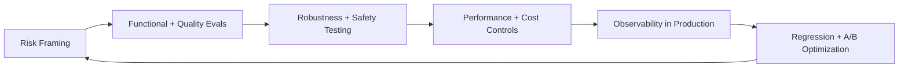

# QA Guide for AI Product

**TestMu Offline Jaipur Meetup** | **April 18, 2026** | **Simform Office, Ahmedabad**  
**Speaker:** Ashish Patel | Senior Principal AI Architect @ Oracle

This cookbook is now organized as **topic-based Docusaurus docs pages**.

## Reading Path

1. [Why AI QA is Broken](./why-ai-qa-is-broken)
2. [6 Pillars of AI QA Testing](./six-pillars)
3. [Defense-in-Depth Architecture](./defense-in-depth)
4. [Real-World Attacks](./real-world-attacks)
5. [RAG Evaluation & Scoring](./rag-evaluation-and-scoring)
6. [Live Observability](./live-observability)
7. [Advanced A/B Testing](./advanced-ab-testing)
8. [Continuous Reliability Loop](./continuous-reliability-loop)
9. [Tools & Practical Implementation](./tools-and-practical-implementation)
10. [Key Takeaways](./key-takeaways)

## End-to-end QA Lifecycle

This will be build with Docusaurus
