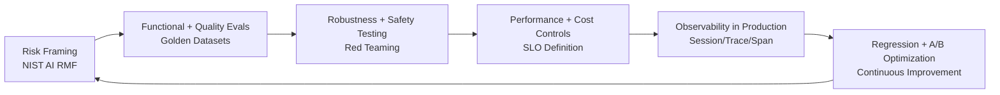

# QA Guide for AI Products

**TestMu Offline Jaipur Meetup** | **April 18, 2026** | **Simform Office, Ahmedabad**  
**Speaker:** Ashish Patel | Senior Principal AI Architect @ Oracle

---

## Why This Cookbook Exists

AI-powered products are shipping faster than QA tooling can keep up. Teams that have spent years mastering deterministic test suites, CI gates, and regression pipelines are suddenly faced with a fundamentally different challenge: systems whose outputs are probabilistic, context-dependent, and capable of failing in ways no unit test can catch.

This cookbook was built from hard-won experience across production LLM deployments. It synthesizes frameworks from NIST AI RMF, OWASP LLM Top 10, academic RAG evaluation research, and real incident post-mortems into a single opinionated, practical guide. Every section leads with a concept but lands on runnable code, concrete metrics, and tooling you can adopt today.

---

## Who This Is For

- **QA engineers** transitioning from functional testing to AI product quality
- **ML engineers** who ship models and want systematic quality gates
- **Platform engineers** building the infra that runs LLM workloads
- **Engineering managers** who own reliability SLOs for AI features

No PhD required. Comfort with Python and basic API concepts assumed.

---

## The Core Problem in One Paragraph

Traditional QA works by specifying exact expected outputs and checking against them. LLMs don't work that way. The same prompt can return ten different but equally valid answers, or occasionally return something harmful, factually wrong, or insecure. The goal of AI QA is not to eliminate this variance — it's to *measure, bound, and manage* it across quality, safety, latency, and cost dimensions simultaneously. That requires a completely different toolbox.

---

## Reading Path

This guide is organized as a progressive journey from first principles to full production implementation:

| Step | Topic | What You'll Learn |
|------|-------|------------------|
| 1 | [Why AI QA is Broken](./why-ai-qa-is-broken) | The accountability gap and paradigm shift |
| 2 | [6 Pillars of AI QA Testing](./six-pillars) | The complete testing taxonomy |
| 3 | [Defense-in-Depth Architecture](./defense-in-depth) | Layered trust and governance controls |
| 4 | [Real-World Attacks](./real-world-attacks) | Attack patterns and red-team strategies |
| 5 | [RAG Evaluation & Scoring](./rag-evaluation-and-scoring) | Context relevance, groundedness, scoring models |
| 6 | [Live Observability](./live-observability) | Session/trace/span telemetry in production |
| 7 | [Advanced A/B Testing](./advanced-ab-testing) | Bandits, contextual routing, experiment guardrails |
| 8 | [Continuous Reliability Loop](./continuous-reliability-loop) | Closing the eval→deploy→observe→iterate loop |
| 9 | [Tools & Practical Implementation](./tools-and-practical-implementation) | Stack, CI integration, golden datasets |
| 10 | [Key Takeaways](./key-takeaways) | Principles, checklist, next steps |

---

## End-to-End QA Lifecycle



This loop never terminates. AI products degrade in production as world knowledge shifts, user behavior evolves, and model providers update their underlying systems. The teams that win are those that instrument this loop tightly and iterate faster than drift accumulates.

---

## The Fundamental Shift: From Assertions to Evaluations

In traditional software QA you write an assertion:

```python
assert response.status_code == 200
assert response.json()["answer"] == "Paris"
```

In AI QA you write an evaluation:

```python
from deepeval.metrics import AnswerRelevancyMetric, FaithfulnessMetric

metrics = [
    AnswerRelevancyMetric(threshold=0.7),
    FaithfulnessMetric(threshold=0.8),
]

test_case = LLMTestCase(
    input="What is the capital of France?",
    actual_output=response["answer"],
    retrieval_context=response["context_chunks"],
)

evaluate([test_case], metrics)
```

The difference matters deeply. Assertions binary-pass or fail. Evaluations return scores, confidence intervals, and failure attribution. An assertion treats the system as a black box. An evaluation treats it as a probabilistic system under test — which is what it actually is.

---

## The Three Failure Modes That Kill AI Products

Understanding what goes wrong in production helps explain why every section of this guide exists.

### 1. Quality Regression After a "Safe" Change

A team updates their system prompt from v1 to v2. All unit tests pass. They ship. Three days later, customer support ticket volume triples. The model started hallucinating dates. No eval caught it because there was no eval suite for temporal reasoning. This is the **golden dataset problem** — you can't catch regression without a curated baseline of known-good test cases tied to every capability.

### 2. Silent Safety Failure

A customer-facing chatbot starts generating responses that technically answer the question but include subtly biased framings. No hard filter triggers. No error is logged. The only signal is a slow drop in user satisfaction scores that takes two weeks to attribute to the model. This is the **safety measurement problem** — toxicity and bias don't announce themselves, they require continuous active measurement.

### 3. Cost Explosion from Prompt Drift

A developer adds 500 tokens of debugging context to a system prompt. It helps during testing. It ships to production. Token costs double overnight. The incident is caught only after an AWS billing alert. This is the **cost observability problem** — token usage must be measured at the workflow level with per-request budgets enforced.

---

## How the Sections Map to These Failures

| Failure Mode | Primary Sections |
|---|---|
| Quality regression | §2 (Six Pillars), §5 (RAG Eval), §8 (Reliability Loop) |
| Silent safety failure | §3 (Defense-in-Depth), §4 (Attacks), §6 (Observability) |
| Cost explosion | §6 (Observability), §9 (Tools), §7 (A/B Testing) |

---

## Tooling Landscape (Quick Reference)

You'll encounter these tools throughout the cookbook. Here's a brief orientation:

| Category | Tool | Role |
|---|---|---|
| Evaluation harness | [DeepEval](https://github.com/confident-ai/deepeval) | Metric-based LLM test runner |
| Evaluation harness | [RAGAS](https://github.com/explodinggradients/ragas) | RAG-specific scoring (faithfulness, relevance) |
| Tracing | [LangSmith](https://www.langchain.com/langsmith) | Session/trace/span observability |
| Tracing | [Arize Phoenix](https://github.com/Arize-ai/phoenix) | Open-source LLM tracing |
| Red teaming | [PyRIT](https://github.com/Azure/PyRIT) | Microsoft's red-team automation |
| Red teaming | [Garak](https://github.com/leondz/garak) | LLM vulnerability scanner |
| Policy / guardrails | [NeMo Guardrails](https://github.com/NVIDIA/NeMo-Guardrails) | Programmable safety rails |
| Policy / guardrails | [Guardrails AI](https://github.com/guardrails-ai/guardrails) | Output validation framework |
| Experiment platform | [GrowthBook](https://www.growthbook.io) | Feature flags + A/B testing |
| CI integration | [pytest](https://pytest.org) + DeepEval | Eval-gated pull request checks |

---

## A Note on Frameworks vs. Tooling

This guide deliberately covers both. Frameworks — like NIST AI RMF's Map/Measure/Manage/Govern loop or the RAG Triad — give you the mental model for *why* something matters. Tooling gives you the means to *implement* it. Neither alone is sufficient.

You'll see code throughout. All examples are in Python and assume you're working with an OpenAI-compatible API surface (which covers GPT-4o, Claude, Gemini, Llama-3, and most enterprise-deployed models via vLLM or AWS Bedrock). Where framework-specific APIs are used, alternatives are called out.

---

## What This Cookbook Does Not Cover

To set accurate expectations:

- **Model training and fine-tuning**: We cover evaluation of trained models, not the training process itself.
- **Infrastructure scaling**: We discuss cost and latency as quality dimensions, but not Kubernetes or GPU cluster management.
- **Legal and regulatory compliance**: The governance section references NIST AI RMF and OWASP, but is not a substitute for legal review on regulated AI applications.
- **Model-specific jailbreaks**: We cover attack patterns and red-team strategies, but not cataloguing every known jailbreak technique for specific model versions.

---

## Getting Started in 15 Minutes

If you want to run your first AI eval today, here's the minimal path:

```bash
pip install deepeval openai
```

```python
import os
from deepeval import evaluate
from deepeval.metrics import AnswerRelevancyMetric
from deepeval.test_case import LLMTestCase

os.environ["OPENAI_API_KEY"] = "your-key"

test_case = LLMTestCase(
    input="Explain what prompt injection is in one paragraph.",
    actual_output="<your model's response here>",
)

metric = AnswerRelevancyMetric(threshold=0.7, model="gpt-4o")
evaluate([test_case], [metric])
```

Run this in a Jupyter notebook or CI pipeline. This single pattern — define a test case, apply a metric, evaluate — scales from one-off checks to a full eval suite of thousands of cases.

---

## How to Use This Cookbook in Practice

**For a new project**: Start at §1 (Why AI QA is Broken) and §2 (Six Pillars) to build the vocabulary. Then jump to §9 (Tools) to set up your baseline eval harness before you write your first user-facing feature.

**For a live system with incidents**: Start at §6 (Observability) to instrument your production traces, then use §4 (Attacks) to audit your current guardrail coverage, and §8 (Reliability Loop) to structure your incident-to-test pipeline.

**For a team doing their first red-team exercise**: §3 (Defense-in-Depth) and §4 (Real-World Attacks) are your starting point. Use the Red-Team Test Matrix in §4 to build your first adversarial test suite.

**For engineering managers defining SLOs**: §6 (Observability) defines the metrics that matter, and §10 (Key Takeaways) has a checklist you can use to audit current coverage.

---

## Final Thought Before You Dive In

The best AI QA programs aren't the ones with the most tests. They're the ones with the right tests, run at the right points in the development lifecycle, with results that feed back into product decisions. This cookbook gives you the map. How far you go depends on your risk profile, your team's capacity, and the stakes of your application.

Let's build something trustworthy.
