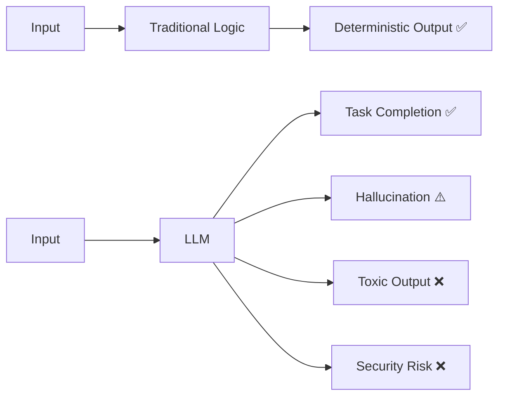

# 1) Why AI QA is Broken

AI QA is fundamentally different from traditional software QA because model outputs are **probabilistic**, not deterministic.

## AI Accountability Gap

Traditional systems: same input → same output.  
LLM systems: same input can produce multiple valid outputs, including unsafe ones.

## Paradigm Shift

- Output Nature: Predictable → Stochastic
- Metric: Pass/Fail → Multi-metric (quality, safety, latency, cost)
- Debugging: Code-only → Prompt/context/retrieval/system chain
