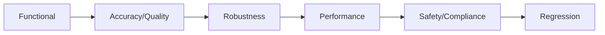

# 2) The 6 Pillars of AI QA Testing

## Pillars

1. Functional Testing
2. Accuracy & Quality Testing
3. Robustness Testing
4. Performance Testing
5. Safety & Compliance
6. Regression Testing

## Practical Checks

- Functional: edge cases, format handling, tool calls
- Quality: golden datasets + human preference + A/B
- Robustness: prompt injection, jailbreaks, OOD prompts
- Performance: p95 latency, throughput, soak/stress
- Safety: toxicity, bias, privacy, misinformation
- Regression: baseline diffs on every PR/deploy
