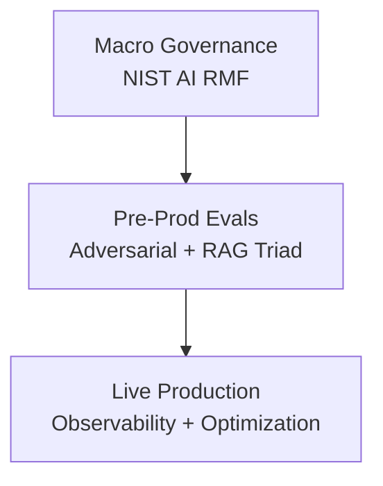

# 3) Defense-in-Depth Architecture

Trustworthy AI requires layered controls, not a single gate.

## 7 Trust Vectors

- Valid & Reliable
- Safe
- Secure & Resilient
- Fair
- Explainable
- Accountable
- Transparent

## Governance Loop

`Map → Measure → Manage → Govern`
