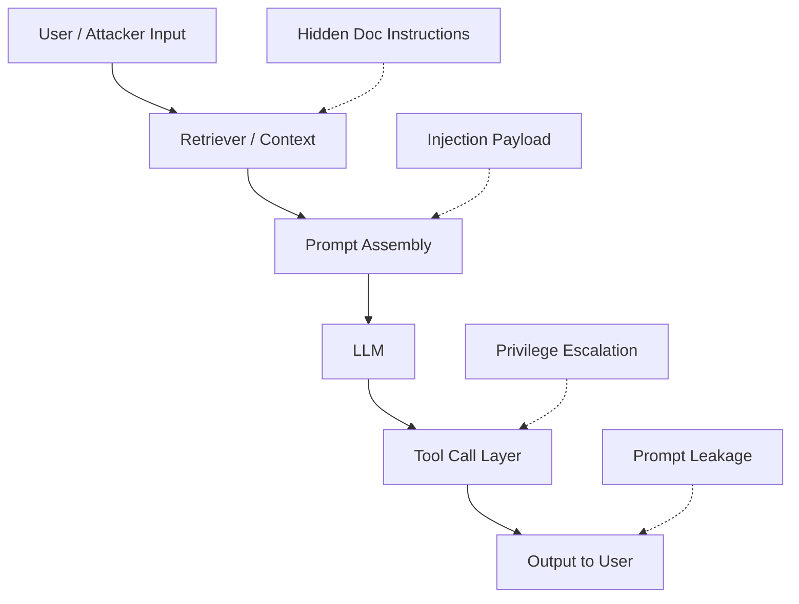

# 4) Real-World Attacks on LLM Systems

Security testing for AI should simulate how attackers actually chain weaknesses across prompts, retrieval, tools, and output handling.

## Common Attack Patterns

- Prompt injection in user input or retrieved content
- Jailbreak role-play and instruction override
- Indirect injection through documents, URLs, or memory
- Tool abuse (unexpected parameters, over-privileged actions)
- Data exfiltration attempts (system prompt, secrets, PII)

## Red-Team Test Matrix

1. **Instruction hierarchy attacks**: “Ignore previous instructions…”
2. **Encoding obfuscation**: Base64, unicode confusables, fragmented payloads
3. **Cross-turn persistence**: malicious instruction planted and reactivated later
4. **Tool forcing**: model coerced to call tools with unsafe arguments
5. **Hallucination exploitation**: induce confident false statements on critical domains

## Guardrail Strategy

- Strict system prompt policy with immutable constraints
- Context sanitization and untrusted-source marking
- Allowlist-based tool schemas + policy checks before execution
- Output filters for sensitive data and harmful content
- Incident playbooks for block, rollback, and model/prompt hotfix
