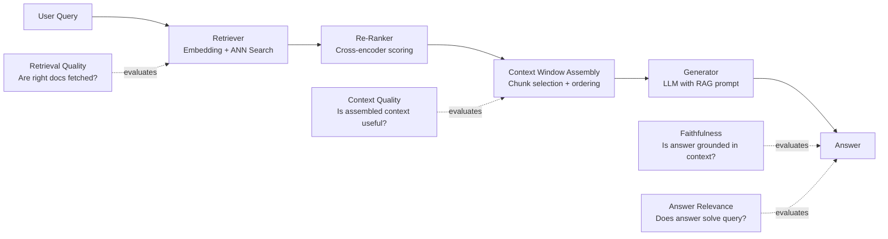

# 5) RAG Evaluation & Scoring

RAG quality is not a single score. You need to evaluate retrieval and generation separately, then combine results for decision-making. A RAG system can fail in at least five distinct ways, and a single composite score masks all of them. Understanding each failure mode and building targeted metrics for each is the foundation of trustworthy RAG quality assurance.

---

## Why RAG Evaluation is Different

A standard LLM evaluation checks output quality against a fixed expected answer. RAG evaluation is fundamentally more complex because the model's output quality depends on a chain of upstream decisions: what to retrieve, how to rank and filter retrieved chunks, how to assemble the context window, and finally how to generate an answer grounded in that context.



Each arrow in this chain is a failure point. A comprehensive RAG evaluation strategy instruments each of them.

---

## The RAG Triad

The RAG Triad — popularized by TruLens and now standard in evaluation frameworks — defines three core metrics that together cover the quality of the complete RAG pipeline:

### Metric 1: Context Relevance

**Question:** Did retrieval fetch useful evidence for this query?

**Definition:** The proportion of retrieved context that is actually relevant to answering the user's query. Irrelevant context wastes context window space, distracts the model, and can introduce confabulation.

**Measurement:** An LLM judge scores each retrieved chunk: "Given the query, is this chunk relevant to answering it?" Average the binary scores across all chunks.

```python
from ragas.metrics import context_precision, context_recall
from datasets import Dataset

def evaluate_context_quality(eval_data: list[dict]) -> dict:
    """
    eval_data: list of dicts with keys:
      - question: str
      - contexts: list[str]  (retrieved chunks)
      - ground_truth: str    (reference answer)
    """
    dataset = Dataset.from_list(eval_data)
    
    result = evaluate(
        dataset=dataset,
        metrics=[context_precision, context_recall],
    )
    
    return {
        "context_precision": result["context_precision"],  # relevance of retrieved chunks
        "context_recall": result["context_recall"],        # coverage of ground truth info
    }
```

**Context Precision vs. Context Recall:**
- **Precision**: Of all retrieved chunks, what fraction was actually useful? High precision = no noise in context.
- **Recall**: Of all the information needed to answer the question, what fraction was retrieved? High recall = nothing critical was missed.

For most production RAG systems, recall matters more than precision: a missed key fact causes a wrong answer, while an extra irrelevant chunk just makes the answer slightly worse. Tune your retrieval to optimize recall with a re-ranker providing precision.

### Metric 2: Groundedness (Faithfulness)

**Question:** Is the answer supported by the retrieved context?

**Definition:** The proportion of claims in the generated answer that are directly supported by (can be traced back to) the retrieved context chunks. A highly grounded answer makes no claims beyond what its evidence supports.

**Why faithfulness failures are dangerous:** An unfaithful answer is confident-sounding misinformation. The model uses fluent language to assert something the retrieved context doesn't support. Users have no way to detect this without checking sources.

```python
from ragas.metrics import faithfulness
from langchain_openai import ChatOpenAI

# Faithfulness evaluation using LLM judge
def measure_faithfulness(question: str, answer: str, contexts: list[str]) -> float:
    """Returns 0-1 score. 1.0 = every claim in answer is grounded in contexts."""
    
    # RAGAS decomposes the answer into atomic claims, then checks each against context
    eval_data = Dataset.from_list([{
        "question": question,
        "answer": answer,
        "contexts": contexts,
    }])
    
    result = evaluate(eval_data, metrics=[faithfulness])
    return result["faithfulness"]

# Manual faithfulness prompt (for custom judge implementations)
FAITHFULNESS_JUDGE_PROMPT = """
You are evaluating whether an AI-generated answer is faithful to its source context.

Retrieved Context:
{context}

Generated Answer:
{answer}

Task: 
1. List every factual claim made in the answer.
2. For each claim, mark it as:
   - GROUNDED: the claim is directly supported by the context
   - UNGROUNDED: the claim is not supported by the context  
   - CONTRADICTED: the claim contradicts the context

3. Return a faithfulness score: (grounded claims) / (total claims)

Output format:
Claims: [list each claim with GROUNDED/UNGROUNDED/CONTRADICTED]
Score: [0.0 to 1.0]
"""
```

### Metric 3: Answer Relevance

**Question:** Does the answer actually solve the user's query?

**Definition:** How well the generated answer addresses the question asked. High answer relevance means the response is on-topic, complete, and useful. Low relevance means the model may have answered a related but different question, or provided tangentially related information.

**Distinction from faithfulness:** An answer can be fully grounded (everything it says is in the context) but still have low relevance (it answers a different question than the one asked). Conversely, an answer can be highly relevant but poorly grounded (it gives the right answer but invents supporting details).

```python
from ragas.metrics import answer_relevancy

def measure_answer_relevancy(question: str, answer: str) -> float:
    """
    RAGAS computes this by: asking an LLM to generate synthetic questions 
    from the answer, then measuring cosine similarity between those synthetic 
    questions and the original question. High similarity = the answer was 
    specifically addressing the original question.
    """
    eval_data = Dataset.from_list([{"question": question, "answer": answer}])
    result = evaluate(eval_data, metrics=[answer_relevancy])
    return result["answer_relevancy"]
```

---

## Extended RAG Metrics

Beyond the core triad, production RAG systems benefit from additional metrics:

### Answer Correctness

Measures factual accuracy of the answer against a ground-truth reference. Requires a labeled dataset with known correct answers.

```python
from ragas.metrics import answer_correctness

# Combines semantic similarity + factual precision/recall
# Best for question-answering systems with definitive correct answers
result = evaluate(dataset, metrics=[answer_correctness])
```

### Citation Accuracy

For RAG systems that surface source citations, verify that citations are accurate:

```python
def check_citation_accuracy(answer: str, cited_sources: list[str], contexts: list[dict]) -> dict:
    """Verify that quoted text in citations matches actual source content."""
    results = []
    
    # Extract cited quotes from answer
    citations = extract_citations(answer)  # parses [Source 1] style citations
    
    for citation in citations:
        source_idx = citation["source_index"]
        quoted_text = citation["quoted_text"]
        
        if source_idx >= len(contexts):
            results.append({"status": "invalid_reference", "citation": citation})
            continue
        
        actual_source = contexts[source_idx]["content"]
        
        # Check if quoted text appears in cited source
        if quoted_text.lower() in actual_source.lower():
            results.append({"status": "accurate", "citation": citation})
        else:
            # Check semantic similarity for paraphrased citations
            similarity = compute_semantic_similarity(quoted_text, actual_source)
            status = "paraphrased" if similarity > 0.8 else "hallucinated"
            results.append({"status": status, "similarity": similarity, "citation": citation})
    
    hallucinated = [r for r in results if r["status"] == "hallucinated"]
    return {
        "total_citations": len(citations),
        "accurate": len([r for r in results if r["status"] == "accurate"]),
        "paraphrased": len([r for r in results if r["status"] == "paraphrased"]),
        "hallucinated": len(hallucinated),
        "hallucination_rate": len(hallucinated) / max(len(citations), 1),
    }
```

### Retrieval Latency and Coverage

```python
import time

def profile_retrieval(query: str, retriever, top_k: int = 5) -> dict:
    start = time.perf_counter()
    chunks = retriever.retrieve(query, top_k=top_k)
    latency_ms = (time.perf_counter() - start) * 1000
    
    return {
        "latency_ms": latency_ms,
        "chunks_returned": len(chunks),
        "mean_relevance_score": sum(c.score for c in chunks) / len(chunks) if chunks else 0,
        "min_relevance_score": min(c.score for c in chunks) if chunks else 0,
    }
```

---

## Practical Scoring Model

### Weighted Composite Score

Different applications should weight the three triad metrics differently based on their risk profile:

```python
from dataclasses import dataclass

@dataclass
class RAGScoringProfile:
    name: str
    context_relevance_weight: float
    faithfulness_weight: float
    answer_relevance_weight: float
    faithfulness_threshold: float  # minimum acceptable faithfulness
    
    def compute_composite(self, scores: dict) -> float:
        weighted = (
            scores["context_relevance"] * self.context_relevance_weight +
            scores["faithfulness"] * self.faithfulness_weight +
            scores["answer_relevance"] * self.answer_relevance_weight
        )
        return weighted / (self.context_relevance_weight + 
                           self.faithfulness_weight + 
                           self.answer_relevance_weight)
    
    def is_acceptable(self, scores: dict) -> bool:
        # Hard floor on faithfulness regardless of composite score
        if scores["faithfulness"] < self.faithfulness_threshold:
            return False
        return self.compute_composite(scores) >= 0.70

# Risk-appropriate scoring profiles
PROFILES = {
    "medical_qa": RAGScoringProfile(
        name="medical_qa",
        context_relevance_weight=1.0,
        faithfulness_weight=3.0,   # faithfulness critical — wrong medical info is dangerous
        answer_relevance_weight=1.5,
        faithfulness_threshold=0.90,  # very high faithfulness floor
    ),
    "customer_support": RAGScoringProfile(
        name="customer_support",
        context_relevance_weight=1.5,
        faithfulness_weight=2.0,
        answer_relevance_weight=2.0,  # relevance matters — users want their question answered
        faithfulness_threshold=0.75,
    ),
    "internal_knowledge_search": RAGScoringProfile(
        name="internal_knowledge_search",
        context_relevance_weight=2.0,
        faithfulness_weight=1.5,
        answer_relevance_weight=1.0,
        faithfulness_threshold=0.65,
    ),
}
```

### Statistical Reporting: Mean vs. Percentiles

Always report both mean and percentile metrics. Mean scores can look acceptable while hiding a long tail of poor-quality responses.

```python
import statistics
import numpy as np

def compute_rag_quality_report(scores_list: list[dict]) -> dict:
    """
    scores_list: list of per-query score dicts, each with:
      context_relevance, faithfulness, answer_relevance
    """
    metrics = ["context_relevance", "faithfulness", "answer_relevance"]
    report = {}
    
    for metric in metrics:
        values = [s[metric] for s in scores_list if metric in s]
        if not values:
            continue
        
        report[metric] = {
            "mean": statistics.mean(values),
            "median": statistics.median(values),
            "p25": float(np.percentile(values, 25)),
            "p75": float(np.percentile(values, 75)),
            "p10": float(np.percentile(values, 10)),  # worst-case tail
            "stdev": statistics.stdev(values) if len(values) > 1 else 0,
            "below_threshold_pct": sum(1 for v in values if v < 0.7) / len(values) * 100,
        }
    
    return report

# Example output:
# {
#   "faithfulness": {
#     "mean": 0.82,
#     "median": 0.87,
#     "p10": 0.41,          ← tail failure: 10% of queries have faithfulness < 0.41
#     "below_threshold_pct": 18.3   ← 18% of responses fail faithfulness threshold
#   }
# }
```

---

## Failure Modes: Taxonomy and Diagnosis

### Failure Mode 1: Missing Context (Retrieval Miss)

**Symptom:** The answer is incomplete or refuses to answer a question that should be answerable.  
**Root cause:** The retriever failed to surface relevant documents.  
**Metrics affected:** Context recall drops. Answer correctness drops.

**Diagnosis:**
```python
def diagnose_retrieval_miss(query: str, answer: str, contexts: list[str], 
                             ground_truth: str) -> dict:
    # Check if ground truth information is absent from retrieved context
    gt_coverage = compute_coverage(ground_truth, " ".join(contexts))
    
    return {
        "diagnosis": "retrieval_miss" if gt_coverage < 0.5 else "generation_failure",
        "ground_truth_coverage": gt_coverage,
        "recommendation": (
            "Improve retrieval: check embedding model, chunk size, or add manual keyword fallback"
            if gt_coverage < 0.5 else
            "Check generation: context was retrieved but not used"
        )
    }
```

**Fix:** Improve embedding model, adjust chunk size (smaller chunks often improve precision, larger improve recall for context-dependent information), add BM25 hybrid retrieval, tune top-k.

### Failure Mode 2: Context Ignored

**Symptom:** Context was retrieved correctly, but the generated answer ignores it and hallucinates instead.  
**Root cause:** The LLM doesn't "look at" the context — either context placement in the prompt is wrong, context is too long, or the model has strong prior beliefs about the topic.  
**Metrics affected:** Context relevance is high, but faithfulness is low.

**Fix:**
- Move relevant context closer to the question in the prompt (models attend better to nearby context)
- Add explicit instruction: "Answer ONLY using the provided context. If the context does not contain the answer, say so."
- Use smaller context windows with higher-quality chunks rather than large noisy contexts

### Failure Mode 3: Confident Confabulation

**Symptom:** The answer sounds fluent and confident but is not grounded in the retrieved context.  
**Root cause:** The model's internal parametric knowledge overrides the context.  
**Metrics affected:** Low faithfulness, but potentially high answer relevance (the model "knows" the right answer but doesn't use context).

**Fix:**
- Stronger system prompt instruction about context-only answering
- Few-shot examples of correct context-grounded answers vs. wrong hallucinated answers
- Consider using a smaller/more instruction-following model that has less strong priors

### Failure Mode 4: Citation Hallucination

**Symptom:** The answer cites a specific source, but the cited content doesn't support the claim.  
**Root cause:** Model fabricates citations by pattern-matching from training data or confabulates source content.  
**Metrics affected:** Citation accuracy score fails.

**Fix:**
- Include explicit source IDs and document boundaries in the prompt
- Post-process to verify all citations before serving to user
- Use structured output to force the model to quote from context rather than paraphrase

### Failure Mode 5: Low-Recall Retrieval → Incomplete Answer

**Symptom:** The answer is partially correct but misses key information.  
**Root cause:** Relevant information exists in the knowledge base but was not retrieved (low recall).  
**Metrics affected:** Answer correctness drops, context recall drops.

**Fix:**
- Increase top-k retrieval
- Use query expansion: generate multiple query variants and take the union of results
- Add metadata filtering to prioritize recent or authoritative documents
- Implement hypothetical document embedding (HyDE): generate a hypothetical answer and use it as the retrieval query

```python
def hyde_retrieval(query: str, llm, retriever, top_k: int = 5) -> list[str]:
    """HyDE: generate hypothetical answer for better retrieval."""
    
    # Step 1: generate a hypothetical document that would answer the query
    hypothetical_doc = llm.complete(
        f"Write a detailed answer to the following question as if you were an expert: {query}"
    )
    
    # Step 2: use the hypothetical doc as the retrieval query (better semantic match)
    chunks = retriever.retrieve(hypothetical_doc, top_k=top_k)
    
    return chunks
```

---

## Building a RAG Evaluation Dataset

### Synthetic Dataset Generation

For new RAG systems without existing labeled data, generate a synthetic evaluation dataset:

```python
from langchain_openai import ChatOpenAI

def generate_rag_eval_dataset(
    knowledge_base_chunks: list[str],
    n_questions: int = 100,
    llm_model: str = "gpt-4o"
) -> list[dict]:
    """Generate question-answer pairs from knowledge base for RAG evaluation."""
    
    llm = ChatOpenAI(model=llm_model)
    dataset = []
    
    for chunk in knowledge_base_chunks[:n_questions]:
        # Generate a question answerable from this chunk
        question_prompt = f"""Based on the following text, generate a specific factual question 
that can be answered using ONLY this text:

Text: {chunk}

Question:"""
        
        question = llm.predict(question_prompt).strip()
        
        # Generate ground truth answer
        answer_prompt = f"""Answer the following question using ONLY the provided text.
Be specific and complete.

Text: {chunk}

Question: {question}

Answer:"""
        
        answer = llm.predict(answer_prompt).strip()
        
        dataset.append({
            "question": question,
            "ground_truth": answer,
            "source_chunk": chunk,
        })
    
    return dataset
```

### Dataset Curation Checklist

A well-curated RAG evaluation dataset should:

| Criterion | Target |
|---|---|
| Total questions | ≥100 for statistical significance |
| Coverage of knowledge base | ≥5 questions per major topic area |
| Multi-hop questions | ≥20% requiring info from multiple chunks |
| Unanswerable questions | ≥10% to test appropriate refusal |
| Ambiguous questions | ≥10% to test disambiguation |
| Human review | ≥30% of questions verified by domain expert |
| Adversarial questions | ≥5% designed to elicit hallucination |

---

## Automated RAG Eval Pipeline

Putting it all together into a CI-integrated evaluation pipeline:

```python
# rag_eval_pipeline.py

import json
from pathlib import Path
from ragas import evaluate
from ragas.metrics import (
    faithfulness, answer_relevancy, context_precision, context_recall, answer_correctness
)
from datasets import Dataset

class RAGEvalPipeline:
    def __init__(self, rag_system, scoring_profile: RAGScoringProfile):
        self.rag = rag_system
        self.profile = scoring_profile
        
    def run(self, eval_dataset_path: str) -> dict:
        eval_data = json.loads(Path(eval_dataset_path).read_text())
        results = []
        
        for item in eval_data:
            # Run RAG pipeline
            rag_output = self.rag.query(item["question"])
            
            results.append({
                "question": item["question"],
                "answer": rag_output["answer"],
                "contexts": rag_output["contexts"],
                "ground_truth": item["ground_truth"],
            })
        
        dataset = Dataset.from_list(results)
        
        ragas_results = evaluate(
            dataset=dataset,
            metrics=[faithfulness, answer_relevancy, context_precision, 
                     context_recall, answer_correctness],
        )
        
        # Build full report
        composite_scores = []
        failures = []
        
        for i, item in enumerate(results):
            scores = {
                "context_relevance": float(ragas_results["context_precision"][i]),
                "faithfulness": float(ragas_results["faithfulness"][i]),
                "answer_relevance": float(ragas_results["answer_relevancy"][i]),
            }
            composite = self.profile.compute_composite(scores)
            composite_scores.append(composite)
            
            if not self.profile.is_acceptable(scores):
                failures.append({
                    "question": item["question"],
                    "scores": scores,
                    "composite": composite,
                    "answer_preview": item["answer"][:200],
                })
        
        report = {
            "overall": {
                "mean_faithfulness": float(ragas_results["faithfulness"].mean()),
                "mean_answer_relevancy": float(ragas_results["answer_relevancy"].mean()),
                "mean_context_precision": float(ragas_results["context_precision"].mean()),
                "mean_context_recall": float(ragas_results["context_recall"].mean()),
                "mean_answer_correctness": float(ragas_results["answer_correctness"].mean()),
                "mean_composite": sum(composite_scores) / len(composite_scores),
                "pass_rate": 1 - len(failures) / len(results),
            },
            "failures": failures[:10],  # top 10 worst cases
            "profile_used": self.profile.name,
        }
        
        # CI gate: fail build if too many failures
        if report["overall"]["pass_rate"] < 0.90:
            raise EvalGateFailure(
                f"RAG eval gate failed: pass_rate={report['overall']['pass_rate']:.2%} < 90%\n"
                f"Top failure: {failures[0] if failures else 'N/A'}"
            )
        
        return report
```

---

## Monitoring RAG Quality in Production

Pre-production evals catch systemic issues. Production monitoring catches distribution shift — when user queries differ from your eval dataset.

```python
# Sample 5% of production queries for async quality evaluation
SAMPLE_RATE = 0.05

async def production_rag_monitor(query: str, rag_output: dict):
    if random.random() > SAMPLE_RATE:
        return
    
    # Async eval — doesn't block the user response
    scores = await compute_rag_scores_async(
        question=query,
        answer=rag_output["answer"],
        contexts=rag_output["contexts"],
    )
    
    # Push to metrics store
    metrics.gauge("rag.faithfulness", scores["faithfulness"])
    metrics.gauge("rag.answer_relevancy", scores["answer_relevancy"])
    metrics.gauge("rag.context_precision", scores["context_precision"])
    
    # Alert if scores drop below threshold
    if scores["faithfulness"] < 0.65:
        alert_oncall("rag_faithfulness_degradation", {
            "score": scores["faithfulness"],
            "query": query[:200],
            "answer_preview": rag_output["answer"][:200],
        })
```

Track these production metrics on a dashboard with rolling 24h and 7d windows. Set alert thresholds at 10% below your pre-production eval baseline. If production faithfulness drops from 0.85 to 0.75, something changed — new user query patterns, knowledge base update, or model provider update — and you want to know before users file support tickets.
