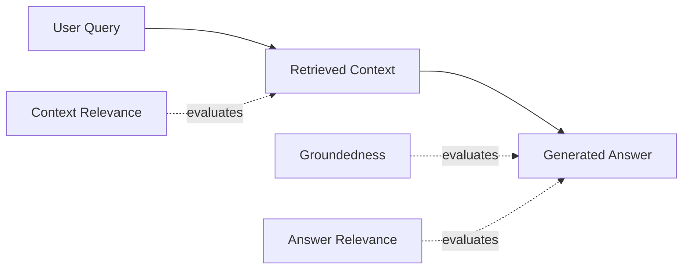

# 5) RAG Evaluation & Scoring

RAG quality is not a single score. You need to evaluate retrieval and generation separately, then combine results for decision-making.

## The RAG Triad

1. **Context Relevance** — did retrieval fetch useful evidence?
2. **Groundedness** — is the answer supported by retrieved context?
3. **Answer Relevance** — does the answer solve the user query?

## Practical Scoring Model

- Score each dimension on 1–5 or 0–1 scale
- Apply weighted aggregate based on product risk profile
- Track both mean and percentile (p50/p95) quality
- Use failure buckets (missing context, wrong citation, unsupported claim)

## Failure Modes to Catch

- Correct answer with wrong/no evidence
- Retrieved context is relevant but answer ignores it
- Answer sounds fluent but is not grounded
- Citation mismatch (source quoted incorrectly)
- Low-recall retrieval causing incomplete answers
