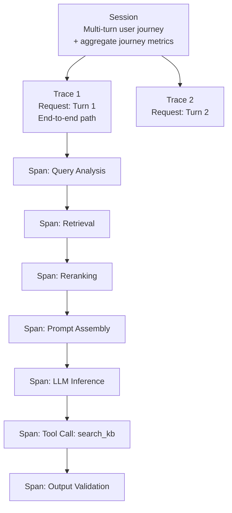

# 6) Live Observability for AI Systems

Pre-production evals are necessary but insufficient. Even the most comprehensive eval suite operates on a fixed, curated dataset. Production traffic is unbounded, unpredictable, and continuously evolving. Production reliability depends on rich, real-time observability — the ability to understand exactly what your AI system is doing, why it produced a specific output, and when quality or safety is degrading.

This section covers the complete observability architecture for LLM systems: the three-level hierarchy (session, trace, span), the metrics that matter, instrumentation patterns, alerting strategy, and operational practices.

---

## Why LLM Observability is Different from Traditional APM

Traditional Application Performance Monitoring (APM) — Datadog, New Relic, Dynatrace — was built for request/response systems where the "quality" of a response is binary (success/error) and performance is captured by latency and error rate.

LLM systems break both assumptions:

1. **Quality is not binary.** A 200 OK response from your LLM endpoint can contain a hallucinated answer, a harmful output, or a response that is technically correct but completely unhelpful. Error rate alone tells you nothing about output quality.

2. **The system is a pipeline, not a function.** An LLM request involves retrieval, prompt assembly, model inference, tool calls, and output post-processing. Each step can fail in its own way. You need span-level visibility into each step, not just end-to-end latency.

3. **Context matters for debugging.** When a user reports a bad response, you need to see the exact prompt sent to the model, the exact context retrieved, the model version used, and the complete tool call sequence. Without this, debugging is guesswork.

4. **Drift is the dominant production failure mode.** Unlike traditional bugs (which are discrete and reproducible), LLM quality issues often manifest as gradual distribution shifts: the quality of responses slowly degrades as user query patterns evolve or the underlying model updates. Detecting these requires tracking statistical quality metrics over time, not just point-in-time checks.

---

## The Three Observability Levels



### Level 1: Session

A **session** is a complete user interaction — typically a multi-turn conversation. Session-level observability answers:
- Did this user accomplish their goal across the whole conversation?
- How many turns did it take?
- Did quality degrade over the conversation?
- Did the user give up, ask for human escalation, or complete their task?

**Key session-level metrics:**
- Session completion rate (did user reach a successful end state?)
- Session length (number of turns)
- Re-prompt rate (how often does the user rephrase the same question?)
- Escalation rate (handoff to human agent)
- Session-level aggregate quality (mean/min quality across turns)

### Level 2: Trace

A **trace** is a single end-to-end request — one turn in a conversation, one API call. Trace-level observability answers:
- How long did this request take end-to-end?
- Which spans contributed most to latency?
- What was the quality score for this specific response?
- Were any safety filters triggered?
- Which model version and configuration were used?

**Key trace-level metadata to capture:**
```python
@dataclass
class TraceMetadata:
    trace_id: str          # unique ID for this request
    session_id: str        # parent session
    user_id: str           # hashed/anonymized
    turn_number: int       # position in conversation
    timestamp_utc: str     # ISO 8601
    model_id: str          # e.g., "gpt-4o-2024-11-20"
    model_temperature: float
    total_input_tokens: int
    total_output_tokens: int
    total_latency_ms: float
    quality_scores: dict   # e.g., {"faithfulness": 0.87, "relevance": 0.91}
    safety_triggered: bool
    safety_score: float
    tool_calls_made: list[str]
    retrieval_chunks_count: int
    cost_usd: float
    error: str | None
```

### Level 3: Span

A **span** is a granular unit of work within a trace. Spans are the core unit for debugging and performance optimization.

**Standard spans for a RAG agent:**

| Span Name | What to Capture |
|---|---|
| `query_analysis` | original query, extracted intent, query rewrite if applied |
| `retrieval` | query embedding, top-k chunks with scores, latency, fallback triggered |
| `reranking` | pre/post-rerank ordering, cross-encoder scores, latency |
| `prompt_assembly` | final prompt character count, token count, context window utilization % |
| `llm_inference` | model ID, input/output tokens, latency (TTFT + total), finish reason |
| `tool_call.*` | tool name, input args, output, latency, success/error |
| `output_validation` | toxicity score, PII detected, schema valid, action taken |

---

## Instrumentation with OpenTelemetry + LangSmith

### OpenTelemetry-Based Tracing

OpenTelemetry is the vendor-neutral standard for observability instrumentation:

```python
from opentelemetry import trace
from opentelemetry.sdk.trace import TracerProvider
from opentelemetry.sdk.trace.export import BatchSpanProcessor
from opentelemetry.exporter.otlp.proto.grpc.trace_exporter import OTLPSpanExporter
import time

# Initialize tracer
provider = TracerProvider()
provider.add_span_processor(
    BatchSpanProcessor(OTLPSpanExporter(endpoint="http://otel-collector:4317"))
)
trace.set_tracer_provider(provider)
tracer = trace.get_tracer("ai-qa-service")

class InstrumentedRAGPipeline:
    def __init__(self, retriever, llm, validator):
        self.retriever = retriever
        self.llm = llm
        self.validator = validator
    
    def query(self, user_query: str, session_id: str) -> dict:
        with tracer.start_as_current_span("rag_pipeline") as pipeline_span:
            pipeline_span.set_attribute("session.id", session_id)
            pipeline_span.set_attribute("query.text", user_query[:500])  # truncate for PII safety
            pipeline_span.set_attribute("query.length_chars", len(user_query))
            
            # Span 1: Retrieval
            with tracer.start_as_current_span("retrieval") as ret_span:
                t0 = time.perf_counter()
                chunks = self.retriever.retrieve(user_query, top_k=5)
                ret_span.set_attribute("retrieval.latency_ms", (time.perf_counter() - t0) * 1000)
                ret_span.set_attribute("retrieval.chunks_count", len(chunks))
                ret_span.set_attribute("retrieval.top_score", chunks[0].score if chunks else 0)
                ret_span.set_attribute("retrieval.min_score", chunks[-1].score if chunks else 0)
            
            # Span 2: Prompt Assembly
            with tracer.start_as_current_span("prompt_assembly") as pa_span:
                prompt = assemble_prompt(user_query, chunks)
                token_count = count_tokens(prompt)
                pa_span.set_attribute("prompt.token_count", token_count)
                pa_span.set_attribute("prompt.context_window_utilization", 
                                      token_count / 128000)  # GPT-4o context window
            
            # Span 3: LLM Inference
            with tracer.start_as_current_span("llm_inference") as llm_span:
                t0 = time.perf_counter()
                response = self.llm.complete(prompt)
                latency_ms = (time.perf_counter() - t0) * 1000
                
                llm_span.set_attribute("llm.model_id", response.model)
                llm_span.set_attribute("llm.input_tokens", response.usage.prompt_tokens)
                llm_span.set_attribute("llm.output_tokens", response.usage.completion_tokens)
                llm_span.set_attribute("llm.latency_ms", latency_ms)
                llm_span.set_attribute("llm.finish_reason", response.choices[0].finish_reason)
                llm_span.set_attribute("llm.cost_usd", 
                                       compute_cost(response.usage, response.model))
            
            # Span 4: Output Validation
            with tracer.start_as_current_span("output_validation") as val_span:
                answer = response.choices[0].message.content
                validation = self.validator.validate(answer)
                val_span.set_attribute("validation.toxicity_score", validation.toxicity)
                val_span.set_attribute("validation.pii_detected", validation.pii_detected)
                val_span.set_attribute("validation.passed", validation.passed)
                
                if not validation.passed:
                    pipeline_span.set_attribute("pipeline.blocked", True)
                    pipeline_span.set_attribute("pipeline.block_reason", validation.reason)
                    answer = SAFE_FALLBACK_RESPONSE
            
            return {
                "answer": answer,
                "contexts": [c.text for c in chunks],
                "trace_id": pipeline_span.context.trace_id,
            }
```

### LangSmith Integration

If you're using LangChain, LangSmith provides first-class tracing with zero boilerplate:

```python
import os
os.environ["LANGCHAIN_TRACING_V2"] = "true"
os.environ["LANGCHAIN_ENDPOINT"] = "https://api.smith.langchain.com"
os.environ["LANGCHAIN_API_KEY"] = "your-langsmith-api-key"
os.environ["LANGCHAIN_PROJECT"] = "production-rag-v2"

# All LangChain/LangGraph operations are now automatically traced
# LangSmith captures: prompts, completions, tool calls, latency, token usage
from langchain_openai import ChatOpenAI
from langchain.chains import RetrievalQA

llm = ChatOpenAI(model="gpt-4o")
chain = RetrievalQA.from_chain_type(llm=llm, retriever=retriever)

# This call is fully traced in LangSmith — no additional code needed
result = chain.invoke({"query": "What is the refund policy?"})
```

### Adding Quality Scores to Traces

The most powerful observability practice is attaching eval scores to production traces:

```python
from langsmith import Client

def log_quality_scores_to_trace(trace_id: str, scores: dict):
    """Attach async quality scores back to a production trace."""
    client = Client()
    
    client.create_feedback(
        run_id=trace_id,
        key="faithfulness",
        score=scores.get("faithfulness"),
        comment="Auto-scored by production quality monitor"
    )
    client.create_feedback(
        run_id=trace_id,
        key="answer_relevancy",
        score=scores.get("answer_relevancy"),
    )

# In production: run quality scoring async and attach scores back
async def async_quality_scorer(trace_id: str, query: str, answer: str, contexts: list[str]):
    """Background task: score quality and attach to trace."""
    scores = await compute_rag_scores_async(query, answer, contexts)
    log_quality_scores_to_trace(trace_id, scores)
    
    # Also push to time-series metrics for dashboarding
    push_to_metrics_store({
        "metric": "rag.faithfulness",
        "value": scores["faithfulness"],
        "tags": {"model": get_model_id(), "env": "production"}
    })
```

---

## Metrics That Matter

### Quality Metrics

| Metric | Measurement Method | Alert Threshold |
|---|---|---|
| Faithfulness (RAG) | Async LLM judge on 5% sample | Drop > 10% from baseline |
| Answer relevancy | Async LLM judge on 5% sample | Drop > 10% from baseline |
| Refusal precision | Rate of appropriate vs. over-refusal | Over-refusal rate > 5% |
| User re-prompt rate | Session analysis | Increase > 20% week-over-week |
| Escalation rate | Handoff events / total sessions | Increase > 15% week-over-week |

### Reliability Metrics

| Metric | Definition | Alert Threshold |
|---|---|---|
| Error rate | HTTP 5xx / total requests | > 1% over 5 minutes |
| Timeout rate | Requests exceeding timeout / total | > 2% over 5 minutes |
| Fallback rate | Fallback responses triggered / total | Increase > 5x baseline |
| Circuit breaker opens | Count per hour | Any opens in production |

### Performance Metrics

| Metric | Definition | Alert Threshold |
|---|---|---|
| P50 latency | Median end-to-end response time | > 2s sustained 5+ minutes |
| P95 latency | 95th percentile response time | > 8s sustained 5+ minutes |
| P99 latency | 99th percentile response time | > 15s sustained 5+ minutes |
| TTFT | Time to first token (streaming) | > 1s P95 |
| Token throughput | Output tokens per second | Drop > 30% from baseline |

### Cost Metrics

| Metric | Definition | Alert Threshold |
|---|---|---|
| Cost per request | Input + output tokens × pricing | > 2× daily moving average |
| Daily token spend | Total tokens × pricing | > 120% of daily budget |
| Cost per session | Aggregate tokens for multi-turn | Sustained increase week-over-week |
| Retrieval cost | Embedding API calls + vector DB queries | Increase > 50% week-over-week |

### Safety Metrics

| Metric | Definition | Alert Threshold |
|---|---|---|
| Policy violation rate | Blocked outputs / total outputs | Any sustained increase |
| Toxicity threshold breaches | Outputs above toxicity floor | Any in 5-minute window |
| Injection attempt rate | Flagged inputs / total inputs | Spike > 5× baseline (attack ongoing) |

---

## Alerting Strategy

### Tiered Alert Severity

```yaml
# alerting_config.yaml

alerts:
  - name: safety_violation_spike
    severity: P1_critical
    condition: "rag.safety.violations_per_minute > 2 for 2 minutes"
    action: [page_oncall, trigger_incident_workflow, increase_sampling_to_100pct]
    
  - name: faithfulness_degradation
    severity: P2_high
    condition: "rag.faithfulness.p50_1h < baseline * 0.85"
    action: [alert_oncall_slack, create_jira_ticket]
    
  - name: latency_p95_spike
    severity: P2_high
    condition: "llm.latency.p95_5m > 8000"
    action: [alert_oncall_slack, auto_scale_check]
    
  - name: cost_budget_warning
    severity: P3_medium
    condition: "cost.daily_spend > daily_budget * 1.2"
    action: [notify_team_slack]
    
  - name: error_rate_elevated
    severity: P2_high
    condition: "http.error_rate.5m > 0.02"
    action: [alert_oncall_slack]
    
  - name: injection_attempt_spike
    severity: P2_high
    condition: "security.injection_attempts_per_minute > baseline * 5"
    action: [alert_security_team, enable_enhanced_logging]
```

### Progressive Sampling

Not every request needs quality scoring in production (it's expensive). Use a progressive sampling strategy:

```python
class AdaptiveSampler:
    def __init__(self, base_rate=0.05, alert_threshold=0.75):
        self.base_rate = base_rate
        self.current_rate = base_rate
        self.alert_threshold = alert_threshold
        self.recent_scores = deque(maxlen=100)
    
    def should_sample(self) -> bool:
        return random.random() < self.current_rate
    
    def update_with_score(self, quality_score: float):
        self.recent_scores.append(quality_score)
        
        if len(self.recent_scores) >= 20:
            mean_score = sum(self.recent_scores) / len(self.recent_scores)
            
            # Increase sampling when quality is declining
            if mean_score < self.alert_threshold:
                self.current_rate = min(1.0, self.base_rate * 10)  # sample everything during incident
            elif mean_score < self.alert_threshold + 0.05:
                self.current_rate = min(0.5, self.base_rate * 3)   # elevated sampling
            else:
                self.current_rate = self.base_rate                  # normal sampling
```

---

## Operational Practices

### Prompt and Context Logging

Log the exact prompt sent to the model (not just the user query) for every sampled trace:

```python
def log_full_trace(trace_id: str, request_data: dict, response_data: dict):
    """
    Stores complete trace for debugging. Apply PII scrubbing before storage.
    """
    scrubbed_prompt = pii_scrubber.scrub(request_data["full_prompt"])
    
    trace_record = {
        "trace_id": trace_id,
        "timestamp": datetime.utcnow().isoformat(),
        "model_id": request_data["model_id"],
        "model_version": request_data["model_version"],
        "system_prompt_hash": hash(request_data["system_prompt"]),  # hash, not plaintext
        "user_query": scrubbed_prompt["user_query"],
        "retrieved_context_ids": request_data["context_chunk_ids"],  # IDs not content
        "full_prompt_token_count": request_data["prompt_tokens"],
        "response_text": scrubbed_prompt["response"],
        "finish_reason": response_data["finish_reason"],
        "latency_ms": response_data["latency_ms"],
        "input_tokens": response_data["input_tokens"],
        "output_tokens": response_data["output_tokens"],
    }
    
    trace_store.write(trace_record)
```

**Important:** Never log raw prompts without PII scrubbing. Prompts frequently contain user-provided personal information.

### Replay Testing from Production Failures

The most valuable regression test cases come from production failures:

```python
class ProductionReplayHarness:
    def __init__(self, trace_store, eval_pipeline):
        self.trace_store = trace_store
        self.eval_pipeline = eval_pipeline
    
    def create_regression_test_from_incident(self, incident_id: str) -> dict:
        """Convert a production incident into a regression test case."""
        
        # Retrieve the failing trace
        trace = self.trace_store.get_trace_by_incident(incident_id)
        
        # Human-annotate what the correct behavior should have been
        expected_behavior = prompt_human_annotation(trace)
        
        test_case = {
            "id": f"regression_{incident_id}",
            "source": "production_incident",
            "incident_date": trace["timestamp"],
            "input": trace["user_query"],
            "retrieved_context": trace["retrieved_context"],
            "actual_output": trace["response_text"],
            "expected_behavior": expected_behavior,
            "failure_type": expected_behavior["failure_classification"],
            "added_to_suite": datetime.utcnow().isoformat(),
        }
        
        # Add to regression suite
        self.eval_pipeline.add_regression_case(test_case)
        
        return test_case
    
    def replay_trace(self, trace_id: str, new_model_config: dict) -> dict:
        """Replay a production trace against a new model config to compare behavior."""
        trace = self.trace_store.get(trace_id)
        
        new_response = run_with_config(
            query=trace["user_query"],
            context=trace["retrieved_context"],
            config=new_model_config,
        )
        
        return {
            "original": trace["response_text"],
            "new": new_response,
            "semantic_similarity": compute_semantic_similarity(
                trace["response_text"], new_response
            ),
        }
```

### Dashboard Design Recommendations

A well-designed AI observability dashboard has three views:

**1. Health Dashboard (always-on, oncall-facing)**
- Current error rate (big number, red/green)
- P95 latency (big number, red/green)
- Safety violations per hour (line chart, last 24h)
- Cost per request today vs. yesterday (comparison)

**2. Quality Dashboard (team-facing, daily review)**
- Faithfulness trend (7-day rolling)
- Answer relevancy trend (7-day rolling)
- User re-prompt rate (7-day rolling)
- Quality score distribution histogram
- Top 10 lowest-quality traces (link to full trace in LangSmith)

**3. Incident Investigation Dashboard (on-demand)**
- Full trace view for a specific trace ID
- Quality score breakdown by span
- Tool calls made with arguments and results
- Retrieved context for this trace
- Safety scores and filter decisions
