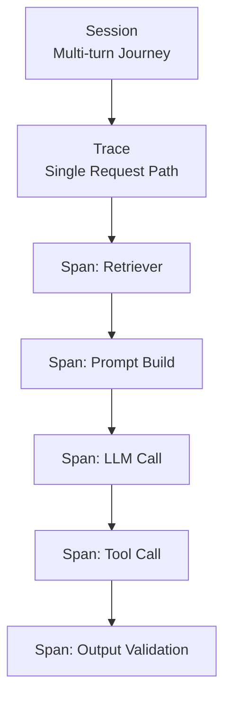

# 6) Live Observability for AI Systems

Pre-production evals are necessary but insufficient. Production reliability depends on rich observability at session, trace, and span levels.

## Observability Layers

- **Session**: full user journey across turns
- **Trace**: one end-to-end request path
- **Span**: granular unit (LLM call, retrieval call, tool execution)

## Metrics That Matter

- Quality: groundedness, relevance, refusal correctness
- Reliability: error rate, timeout rate, fallbacks triggered
- Performance: p50/p95 latency, token usage, throughput
- Cost: cost per request/session, retrieval overhead
- Safety: policy violations, blocked outputs, escalations

## Operational Practices

- Log prompts, context IDs, tool calls, and model/version tags
- Attach eval scores to traces for root-cause analysis
- Alert on drift in quality or latency percentiles
- Use replay suites from production failures into regression pipelines
