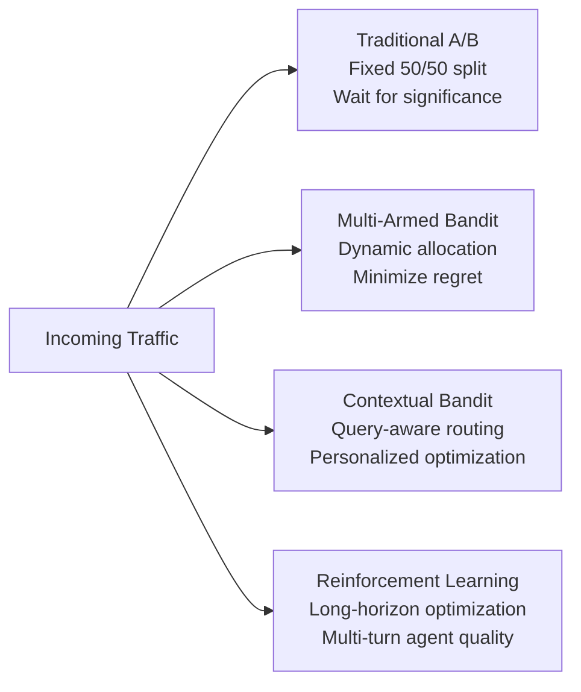
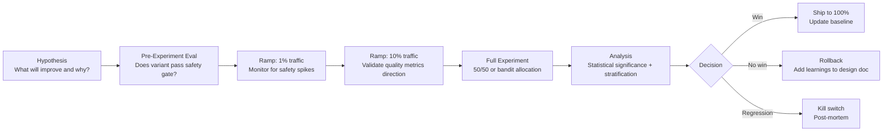

# 7) Advanced A/B Testing for LLM Applications

Classic static A/B splits are a starting point. AI products benefit from adaptive routing strategies that optimize user outcomes continuously. This section covers the full spectrum — from foundational A/B testing, through multi-armed bandits and contextual routing, to the experiment design guardrails that prevent optimization from compromising safety.

---

## Why LLM Experimentation Is Different

Traditional A/B testing was designed for marketing and product UX experiments where:
- Each variant produces a binary outcome (click/no-click, convert/don't-convert)
- Variants are stable (the "treatment" doesn't drift over time)
- Sample sizes are large and arrive quickly (millions of web visitors per day)

LLM experiments violate all three assumptions:

**Multi-dimensional outcomes.** A response can be high quality but unsafe, low latency but expensive, or highly relevant but poorly grounded. Optimizing on a single metric (e.g., user thumbs-up rate) while ignoring others leads to perverse results — you'll ship the variant that users rate highest even if it has a higher hallucination rate.

**Variant instability.** The "treatment" (a new model, prompt, or retrieval config) can behave differently across query types. A prompt that improves factual QA may degrade code generation. You need stratified analysis, not just aggregate metrics.

**Small, slow traffic.** Many enterprise AI products have thousands of daily users, not millions. Traditional A/B testing requires large samples to detect small effects. LLMs make this worse: evaluation requires running LLM-as-judge on each response, which is expensive to do on 100% of traffic.

---

## Evolution of Online Experimentation



Each tier offers more power and more complexity. Start with A/B, add bandit optimization when you have clear winning metrics, add contextual routing when you have distinct user segments or query types.

---

## Tier 1: Classic A/B Testing

### When to Use

- Comparing two distinct system prompt versions
- Evaluating a new model (e.g., GPT-4o vs. Claude 3.5 Sonnet)
- Testing a major retrieval pipeline change (new chunking strategy, new embedding model)
- When you need clean causal attribution for a business decision

### Design Principles for LLM A/B Tests

**Define your primary metric before running.** For LLM systems, the primary metric is usually a composite quality score, not a single dimension. Define it upfront to avoid p-hacking.

**Use holdout groups.** Reserve 10% of traffic as a pure control that never sees any experiment variants. This lets you detect overall system drift independently of individual experiments.

**Account for session effects.** A/B assignment should be at the session level, not the request level. If a user's first turn is served by variant A and their second by variant B, you'll contaminate your analysis with inter-variant cross-talk.

```python
import hashlib
from enum import Enum

class Variant(str, Enum):
    CONTROL = "control"
    TREATMENT = "treatment"
    HOLDOUT = "holdout"

def assign_variant(
    session_id: str,
    experiment_id: str,
    control_pct: float = 0.45,
    treatment_pct: float = 0.45,
    # holdout = remaining 10%
) -> Variant:
    """Deterministic, sticky assignment — same session always gets same variant."""
    
    # Hash session + experiment to get a stable pseudo-random value
    hash_input = f"{session_id}:{experiment_id}".encode()
    hash_value = int(hashlib.sha256(hash_input).hexdigest(), 16)
    bucket = (hash_value % 1000) / 1000.0  # 0.0 to 1.0
    
    if bucket < control_pct:
        return Variant.CONTROL
    elif bucket < control_pct + treatment_pct:
        return Variant.TREATMENT
    else:
        return Variant.HOLDOUT

def run_experiment(session_id: str, user_query: str, experiment: dict) -> dict:
    variant = assign_variant(session_id, experiment["id"])
    
    config = experiment["variants"][variant.value]
    response = call_model_with_config(user_query, config)
    
    log_experiment_event({
        "experiment_id": experiment["id"],
        "variant": variant.value,
        "session_id": session_id,
        "response": response,
    })
    
    return response
```

### Statistical Analysis

```python
from scipy import stats
import numpy as np

def analyze_ab_experiment(
    control_scores: list[float],
    treatment_scores: list[float],
    primary_metric: str = "composite_quality",
    significance_level: float = 0.05,
) -> dict:
    
    # Welch's t-test (doesn't assume equal variance)
    t_stat, p_value = stats.ttest_ind(treatment_scores, control_scores, equal_var=False)
    
    # Effect size (Cohen's d)
    pooled_std = np.sqrt((np.std(control_scores)**2 + np.std(treatment_scores)**2) / 2)
    cohens_d = (np.mean(treatment_scores) - np.mean(control_scores)) / pooled_std
    
    # 95% confidence interval on the difference
    diff = np.mean(treatment_scores) - np.mean(control_scores)
    se_diff = np.sqrt(np.var(treatment_scores)/len(treatment_scores) + 
                      np.var(control_scores)/len(control_scores))
    ci_lower = diff - 1.96 * se_diff
    ci_upper = diff + 1.96 * se_diff
    
    significant = p_value < significance_level
    
    return {
        "metric": primary_metric,
        "control_mean": np.mean(control_scores),
        "treatment_mean": np.mean(treatment_scores),
        "absolute_lift": diff,
        "relative_lift_pct": (diff / np.mean(control_scores)) * 100,
        "p_value": p_value,
        "significant": significant,
        "cohens_d": cohens_d,
        "ci_95": (ci_lower, ci_upper),
        "n_control": len(control_scores),
        "n_treatment": len(treatment_scores),
        "recommendation": "ship treatment" if significant and diff > 0 else
                          "more data needed" if not significant else
                          "revert to control",
    }
```

---

## Tier 2: Multi-Armed Bandits

### When to Use

- You have ≥3 variants to compare and want to converge faster than running sequential A/B tests
- You expect one variant to clearly outperform and want to minimize traffic sent to inferior variants
- Your experimentation cadence is high (multiple experiments per month)

### Thompson Sampling

Thompson Sampling is the most commonly used bandit algorithm for quality metrics:

```python
import numpy as np
from dataclasses import dataclass, field

@dataclass
class BetaArm:
    """Beta distribution arm for Thompson Sampling with binary/bounded success metric."""
    name: str
    alpha: float = 1.0  # successes + 1 (Beta prior)
    beta: float = 1.0   # failures + 1
    
    def sample(self) -> float:
        """Sample from the posterior belief distribution."""
        return np.random.beta(self.alpha, self.beta)
    
    def update(self, reward: float, threshold: float = 0.75):
        """Update posterior with observed reward."""
        # Treat reward above threshold as "success"
        if reward >= threshold:
            self.alpha += 1
        else:
            self.beta += 1
    
    @property
    def posterior_mean(self) -> float:
        return self.alpha / (self.alpha + self.beta)

class ThompsonSamplingBandit:
    def __init__(self, variant_configs: dict):
        self.arms = {name: BetaArm(name=name) for name in variant_configs}
        self.configs = variant_configs
        self.total_pulls = 0
    
    def select_variant(self) -> str:
        """Select variant with highest Thompson sample."""
        samples = {name: arm.sample() for name, arm in self.arms.items()}
        return max(samples, key=samples.get)
    
    def update(self, variant_name: str, quality_score: float):
        """Update arm with observed quality score."""
        self.arms[variant_name].update(quality_score)
        self.total_pulls += 1
    
    def get_status(self) -> dict:
        return {
            name: {
                "pulls": arm.alpha + arm.beta - 2,
                "posterior_mean": arm.posterior_mean,
                "alpha": arm.alpha,
                "beta": arm.beta,
            }
            for name, arm in self.arms.items()
        }
```

### Epsilon-Greedy for Exploration

A simpler alternative when you want predictable exploration rates:

```python
class EpsilonGreedyBandit:
    def __init__(self, variant_names: list[str], epsilon: float = 0.1):
        self.epsilon = epsilon
        self.variants = variant_names
        self.reward_history = {v: [] for v in variant_names}
    
    def select_variant(self) -> str:
        if random.random() < self.epsilon:
            # Explore: random variant
            return random.choice(self.variants)
        else:
            # Exploit: best known variant
            means = {
                v: np.mean(scores) if scores else 0.5
                for v, scores in self.reward_history.items()
            }
            return max(means, key=means.get)
    
    def update(self, variant: str, reward: float):
        self.reward_history[variant].append(reward)
```

### Regret Tracking

The key metric for bandit performance is **cumulative regret** — the total quality lost by exploring suboptimal variants:

```python
def compute_cumulative_regret(
    bandit_log: list[dict],
    optimal_variant: str,
    optimal_mean_reward: float,
) -> list[float]:
    """Track regret over time to evaluate bandit convergence speed."""
    regret = []
    cumulative = 0
    
    for event in bandit_log:
        if event["variant"] != optimal_variant:
            cumulative += optimal_mean_reward - event["reward"]
        regret.append(cumulative)
    
    return regret
```

---

## Tier 3: Contextual Bandits

### When to Use

- Different query types perform better with different model configurations
- User segments have distinct quality preferences
- You want to personalize routing by domain, complexity, or risk tier

### Feature Engineering for Context

```python
from dataclasses import dataclass

@dataclass
class QueryContext:
    query_length: int
    query_domain: str          # "technical", "casual", "legal", "medical"
    query_complexity: float    # 0-1 estimated complexity
    user_tier: str             # "free", "pro", "enterprise"
    session_turn: int          # position in conversation
    time_of_day: int           # 0-23 (proxy for user type)
    
    def to_feature_vector(self) -> np.ndarray:
        domain_encoding = {"technical": 0, "casual": 1, "legal": 2, "medical": 3}
        tier_encoding = {"free": 0, "pro": 1, "enterprise": 2}
        
        return np.array([
            self.query_length / 1000,
            domain_encoding.get(self.query_domain, 0) / 3,
            self.query_complexity,
            tier_encoding.get(self.user_tier, 0) / 2,
            min(self.session_turn, 20) / 20,
            self.time_of_day / 23,
        ])

def classify_query_context(query: str, user_metadata: dict) -> QueryContext:
    """Extract context features from query and user metadata."""
    return QueryContext(
        query_length=len(query),
        query_domain=classify_domain(query),  # classifier or keyword heuristic
        query_complexity=estimate_complexity(query),
        user_tier=user_metadata.get("tier", "free"),
        session_turn=user_metadata.get("turn_number", 1),
        time_of_day=datetime.now().hour,
    )
```

### LinUCB Contextual Bandit

LinUCB learns a linear model of how context features predict reward for each variant:

```python
import numpy as np

class LinUCBArm:
    def __init__(self, feature_dim: int, alpha: float = 1.0):
        self.A = np.identity(feature_dim)  # feature covariance
        self.b = np.zeros(feature_dim)      # reward correlations
        self.alpha = alpha                   # exploration coefficient
    
    def score(self, x: np.ndarray) -> float:
        """Upper confidence bound for this arm given context x."""
        A_inv = np.linalg.inv(self.A)
        theta = A_inv @ self.b
        
        exploitation = theta @ x
        exploration = self.alpha * np.sqrt(x @ A_inv @ x)
        
        return exploitation + exploration
    
    def update(self, x: np.ndarray, reward: float):
        self.A += np.outer(x, x)
        self.b += reward * x

class LinUCBContextualBandit:
    def __init__(self, variant_names: list[str], feature_dim: int, alpha: float = 1.0):
        self.arms = {name: LinUCBArm(feature_dim, alpha) for name in variant_names}
    
    def select_variant(self, context: QueryContext) -> str:
        x = context.to_feature_vector()
        scores = {name: arm.score(x) for name, arm in self.arms.items()}
        return max(scores, key=scores.get)
    
    def update(self, variant: str, context: QueryContext, reward: float):
        x = context.to_feature_vector()
        self.arms[variant].update(x, reward)
```

### Practical Routing with GrowthBook

For teams that don't want to implement bandit algorithms from scratch, GrowthBook provides a managed experimentation platform with contextual feature targeting:

```python
from growthbook import GrowthBook

def get_model_config_for_request(user_id: str, query: str, user_metadata: dict) -> dict:
    gb = GrowthBook(
        api_host="https://cdn.growthbook.io",
        client_key=os.environ["GROWTHBOOK_CLIENT_KEY"],
        attributes={
            "user_id": user_id,
            "query_domain": classify_domain(query),
            "user_tier": user_metadata.get("tier", "free"),
            "query_complexity": estimate_complexity(query),
        }
    )
    
    gb.load_features()
    
    # Feature flag determines model routing
    model_variant = gb.get_feature_value("model_routing_variant", "control")
    
    configs = {
        "control":    {"model": "gpt-4o-2024-11-20",   "temperature": 0.2},
        "treatment_a": {"model": "gpt-4o-mini-2024-07-18", "temperature": 0.1},  # cheaper
        "treatment_b": {"model": "claude-sonnet-4-6",   "temperature": 0.2},  # different provider
    }
    
    return configs[model_variant]
```

---

## AI-Specific Experiment Metrics

### The Composite Outcome Metric

The primary metric for most LLM experiments should be a composite score that reflects multiple quality dimensions simultaneously:

```python
@dataclass
class ExperimentOutcome:
    quality_score: float      # faithfulness + relevance composite (0-1)
    safety_score: float       # 1 - toxicity score (0-1)
    latency_score: float      # 1 - normalized latency (0-1)
    cost_score: float         # 1 - normalized cost (0-1)
    task_success: bool        # user achieved their goal
    
    def composite(
        self,
        quality_w=0.4,
        safety_w=0.3,
        latency_w=0.15,
        cost_w=0.15,
    ) -> float:
        return (
            self.quality_score * quality_w +
            self.safety_score * safety_w +
            self.latency_score * latency_w +
            self.cost_score * cost_w
        )

def compute_outcomes_for_session(session_trace: dict) -> ExperimentOutcome:
    return ExperimentOutcome(
        quality_score=session_trace["mean_quality_score"],
        safety_score=1.0 - session_trace["max_toxicity_score"],
        latency_score=1.0 - min(session_trace["p95_latency_ms"] / 10000, 1.0),
        cost_score=1.0 - min(session_trace["total_cost_usd"] / 0.10, 1.0),
        task_success=session_trace["task_completed"],
    )
```

### User Behavioral Metrics

Beyond automated quality scores, user behavior provides signal about true quality:

| Metric | How to Measure | Interpretation |
|---|---|---|
| Re-prompt rate | Count of semantically similar follow-up queries | High = first answer didn't satisfy |
| Session abandonment rate | Sessions ending without completion | High = user gave up |
| Copy-paste rate | User copying model output to clipboard | High = output was useful |
| Thumbs up/down rate | Explicit feedback when surfaced | Direct satisfaction signal |
| Time-to-next-turn | Latency between model response and user's next message | Very fast = user dissatisfied with response |

---

## Experiment Guardrails

### Safety Floor Enforcement

No experiment variant should ever be allowed below a minimum safety threshold, regardless of quality improvements:

```python
SAFETY_FLOOR = {
    "toxicity_rate": 0.01,      # max 1% of responses above toxicity threshold
    "injection_success_rate": 0.001,  # max 0.1% injection attempts succeed
    "pii_leak_rate": 0.0,       # zero tolerance for PII leakage
}

def check_safety_floor(variant_metrics: dict) -> tuple[bool, list[str]]:
    violations = []
    
    for metric, floor in SAFETY_FLOOR.items():
        observed = variant_metrics.get(metric, 0)
        if observed > floor:
            violations.append(
                f"{metric}: {observed:.4f} exceeds floor {floor:.4f}"
            )
    
    return len(violations) == 0, violations

def evaluate_experiment_variant(variant_name: str, metrics: dict) -> dict:
    safe, violations = check_safety_floor(metrics)
    
    if not safe:
        return {
            "variant": variant_name,
            "decision": "reject",
            "reason": "safety_floor_violation",
            "violations": violations,
        }
    
    # Only evaluate quality if safety floor passes
    quality_win = metrics["composite_quality"] > metrics["baseline_composite_quality"]
    
    return {
        "variant": variant_name,
        "decision": "ship" if quality_win else "reject",
        "reason": "quality_improvement" if quality_win else "no_significant_improvement",
        "metrics": metrics,
    }
```

### Kill Switch for Harmful Behavior Spikes

```python
class ExperimentKillSwitch:
    def __init__(self, safety_spike_threshold=5.0):
        self.baseline_rates = {}
        self.safety_spike_threshold = safety_spike_threshold
    
    def set_baseline(self, experiment_id: str, variant: str, safety_rate: float):
        self.baseline_rates[f"{experiment_id}:{variant}"] = safety_rate
    
    def check_and_kill(self, experiment_id: str, variant: str, 
                        current_safety_rate: float) -> bool:
        key = f"{experiment_id}:{variant}"
        baseline = self.baseline_rates.get(key, 0.001)
        
        spike_factor = current_safety_rate / max(baseline, 0.0001)
        
        if spike_factor > self.safety_spike_threshold:
            # Kill the variant immediately
            disable_variant(experiment_id, variant)
            
            alert_oncall({
                "type": "experiment_kill_switch_triggered",
                "experiment_id": experiment_id,
                "variant": variant,
                "baseline_safety_rate": baseline,
                "current_safety_rate": current_safety_rate,
                "spike_factor": spike_factor,
            })
            
            return True  # variant was killed
        
        return False  # variant continues
```

### Sequential Testing: Avoiding Peeking

Looking at experiment results before collecting enough data leads to false positives. Use sequential testing to make valid early-stopping decisions:

```python
from scipy.stats import norm

def sequential_test(
    control_successes: int,
    control_trials: int,
    treatment_successes: int,
    treatment_trials: int,
    alpha: float = 0.05,
    power: float = 0.80,
    min_detectable_effect: float = 0.02,
) -> dict:
    """
    Sequential probability ratio test (SPRT) — valid at any sample size.
    Returns decision: 'continue', 'ship_treatment', or 'ship_control'.
    """
    if control_trials < 100 or treatment_trials < 100:
        return {"decision": "continue", "reason": "insufficient_data"}
    
    p_control = control_successes / control_trials
    p_treatment = treatment_successes / treatment_trials
    
    # Z-test with Bonferroni correction for sequential testing
    # Use alpha/2 as boundary to account for multiple looks
    adjusted_alpha = alpha / np.log(max(control_trials, 2))
    
    se = np.sqrt(p_control*(1-p_control)/control_trials + 
                 p_treatment*(1-p_treatment)/treatment_trials)
    z_score = (p_treatment - p_control) / max(se, 1e-10)
    p_value = 2 * (1 - norm.cdf(abs(z_score)))
    
    if p_value < adjusted_alpha:
        decision = "ship_treatment" if p_treatment > p_control else "ship_control"
    else:
        decision = "continue"
    
    return {
        "decision": decision,
        "p_value": p_value,
        "z_score": z_score,
        "control_rate": p_control,
        "treatment_rate": p_treatment,
        "n_control": control_trials,
        "n_treatment": treatment_trials,
    }
```

---

## Stratified Analysis

Always analyze experiment results stratified by query type, user segment, and capability domain. Aggregate metrics can mask regressions in specific strata:

```python
def stratified_experiment_analysis(events: list[dict]) -> dict:
    """Analyze experiment results by user tier and query domain."""
    
    strata = {}
    
    for event in events:
        key = (event["variant"], event["user_tier"], event["query_domain"])
        if key not in strata:
            strata[key] = []
        strata[key].append(event["quality_score"])
    
    results = {}
    for (variant, tier, domain), scores in strata.items():
        results[f"{variant}|{tier}|{domain}"] = {
            "mean_quality": np.mean(scores),
            "n": len(scores),
        }
    
    # Check for Simpson's paradox: aggregate win but stratum loss
    paradox_warning = []
    for tier in ["free", "pro", "enterprise"]:
        for domain in ["technical", "casual", "legal"]:
            control_key = f"control|{tier}|{domain}"
            treatment_key = f"treatment|{tier}|{domain}"
            
            if control_key in results and treatment_key in results:
                control_mean = results[control_key]["mean_quality"]
                treatment_mean = results[treatment_key]["mean_quality"]
                
                if treatment_mean < control_mean - 0.05:
                    paradox_warning.append({
                        "tier": tier,
                        "domain": domain,
                        "control_mean": control_mean,
                        "treatment_mean": treatment_mean,
                        "regression": control_mean - treatment_mean,
                    })
    
    return {
        "strata_results": results,
        "regression_warnings": paradox_warning,
    }
```

---

## Experiment Lifecycle



The staged ramp is the most important safety mechanism in LLM experimentation. A 1% ramp with 30 minutes of monitoring catches safety issues before they affect the majority of users.
