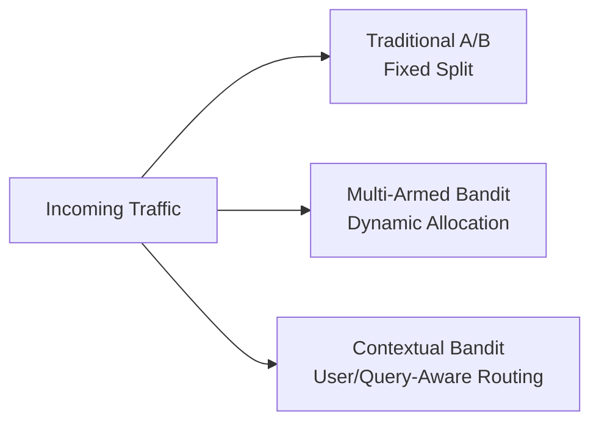

# 7) Advanced A/B Testing for LLM Apps

Classic static A/B splits are a starting point. AI products benefit from adaptive routing strategies that optimize user outcomes continuously.

## Evolution of Online Experimentation

## When to Use What

- **A/B**: stable baselines, clean causal comparison
- **MAB**: faster optimization when winner is expected
- **Contextual Bandit**: personalization by query type, user segment, or risk tier

## AI-Specific Experiment Metrics

- Task success rate
- Groundedness/relevance composite
- User correction rate / re-prompt rate
- Cost per successful outcome
- Safety incident rate and refusal precision

## Guardrails for Experimentation

- Minimum safety floor per variant
- Kill-switch for harmful behavior spikes
- Stratified analysis to avoid aggregate metric masking
- Sequential testing controls to prevent premature conclusions
