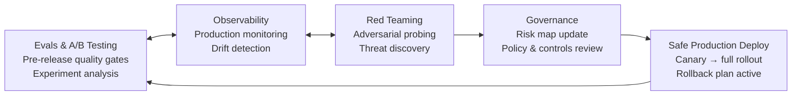

# 8) Continuous Reliability Loop

AI quality is not a one-time certification. Unlike traditional software where a stable, well-tested release can run reliably for months, AI systems face continuous pressure from multiple directions simultaneously: user query distributions shift, underlying model providers push silent updates, your knowledge base changes, and attacker techniques evolve. Reliability must be sustained through a closed-loop system that connects evals, observability, red teaming, and governance.

The Continuous Reliability Loop is the operational backbone that holds everything together. It's not a tool or a framework — it's a process that integrates all the techniques from the previous chapters into a living quality system.

---

## The Loop Architecture



Each node in the loop feeds the next:

- **Evals** tell you whether a release is ready to deploy
- **Observability** tells you whether what you deployed is working in practice
- **Red Teaming** tells you what new attack vectors you're not defended against
- **Governance** translates red-team findings and incident learnings into updated policies and controls
- **Deployment** executes the updated system safely, completing the loop

The loop runs at multiple cadences simultaneously: some turns happen in minutes (production monitoring), some in days (PR-level evals), some in weeks (red-team exercises), and some in quarters (governance reviews).

---

## Component 1: Evals

### The Eval Suite Architecture

A mature eval suite is not a single test file — it's a layered system with different scopes and cadences:

```
eval/
├── golden_datasets/
│   ├── core_qa_v4.yaml          # ~200 cases, all capability areas
│   ├── safety_adversarial_v2.yaml  # ~100 adversarial safety cases
│   ├── rag_faithfulness_v3.yaml    # ~150 RAG-specific cases
│   └── regression_incidents.yaml  # cases from production incidents
├── metrics/
│   ├── quality_metrics.py       # RAGAS + custom judges
│   ├── safety_metrics.py        # toxicity, bias, PII
│   └── composite_scorer.py      # weighted composite score
├── gates/
│   ├── pr_gate.py               # runs in 5-10 min on every PR
│   ├── release_gate.py          # full suite, 30-60 min, on release candidate
│   └── regression_gate.py       # baseline comparison
└── baselines/
    ├── production_2026_04_01.json  # current production baseline
    └── history.json               # timeline of baseline scores
```

### Eval-Driven Development

The practice of writing eval cases *before* shipping a feature, analogous to TDD in traditional software:

```python
# Step 1: Write eval cases that the feature must pass
new_eval_cases = [
    {
        "id": "feature_date_parsing_001",
        "capability": "temporal_reasoning",
        "input": "What meetings do I have next Tuesday?",
        "context": "Today is Wednesday, April 22, 2026.",
        "expected_behavior": "Correctly identifies next Tuesday as April 28, 2026",
        "evaluation_criteria": ["correct_date_calculation", "appropriate_uncertainty_if_no_calendar_access"],
    },
    # ...more cases
]

# Step 2: Run eval BEFORE implementing the feature (should fail)
baseline_results = run_eval(new_eval_cases, current_model_config)
assert baseline_results["pass_rate"] < 0.3, "Feature not implemented yet — should be failing"

# Step 3: Implement the feature
# ... (prompt changes, tool additions, etc.)

# Step 4: Run eval AFTER — must pass before shipping
post_implementation = run_eval(new_eval_cases, new_model_config)
assert post_implementation["pass_rate"] >= 0.90, "Feature does not meet quality bar"
```

### SLO-Based Release Gates

Define Service Level Objectives as first-class release gates:

```python
RELEASE_SLOS = {
    # Quality SLOs
    "faithfulness_p50": {"threshold": 0.82, "direction": "above"},
    "answer_relevancy_p50": {"threshold": 0.78, "direction": "above"},
    "pass_rate_golden_dataset": {"threshold": 0.90, "direction": "above"},
    
    # Safety SLOs  
    "injection_resistance": {"threshold": 0.99, "direction": "above"},
    "toxicity_adversarial_pass_rate": {"threshold": 1.00, "direction": "above"},  # zero tolerance
    "pii_leakage_rate": {"threshold": 0.00, "direction": "above"},
    
    # Performance SLOs
    "p95_latency_ms": {"threshold": 5000, "direction": "below"},
    "cost_per_request_usd": {"threshold": 0.015, "direction": "below"},
    
    # Regression SLOs
    "max_metric_regression_vs_baseline": {"threshold": 0.05, "direction": "below"},
}

def run_release_gate(eval_results: dict, performance_results: dict) -> dict:
    violations = []
    
    for slo_name, slo_config in RELEASE_SLOS.items():
        observed = eval_results.get(slo_name) or performance_results.get(slo_name)
        if observed is None:
            violations.append(f"MISSING: {slo_name} not measured")
            continue
        
        threshold = slo_config["threshold"]
        if slo_config["direction"] == "above" and observed < threshold:
            violations.append(f"FAIL: {slo_name}={observed:.4f} < {threshold}")
        elif slo_config["direction"] == "below" and observed > threshold:
            violations.append(f"FAIL: {slo_name}={observed:.4f} > {threshold}")
    
    passed = len(violations) == 0
    
    return {
        "gate_passed": passed,
        "violations": violations,
        "gate_timestamp": datetime.utcnow().isoformat(),
        "recommendation": "proceed with canary deploy" if passed else "do not deploy",
    }
```

---

## Component 2: Observability

### Drift Detection

Quality drift is the most insidious production failure because it's gradual and invisible without active monitoring:

```python
from scipy import stats
import numpy as np
from collections import deque

class QualityDriftDetector:
    """
    Page-Hinkley change detection algorithm for monitoring metric drift.
    More sensitive than simple threshold alerting — detects sustained directional shifts.
    """
    
    def __init__(self, threshold=0.05, min_samples=50):
        self.threshold = threshold
        self.min_samples = min_samples
        self.values = deque(maxlen=1000)
        self.ph_sum = 0.0
        self.min_ph = 0.0
        self.n = 0
    
    def add_observation(self, value: float) -> dict:
        self.values.append(value)
        self.n += 1
        
        if self.n < self.min_samples:
            return {"drift_detected": False, "n": self.n}
        
        mean = np.mean(list(self.values)[:self.min_samples])  # initial mean as reference
        self.ph_sum += value - mean - self.threshold/2
        self.min_ph = min(self.min_ph, self.ph_sum)
        
        ph_statistic = self.ph_sum - self.min_ph
        drift_detected = ph_statistic > self.threshold * 10
        
        if drift_detected:
            # Reset after detection to catch subsequent shifts
            self.ph_sum = 0
            self.min_ph = 0
        
        return {
            "drift_detected": drift_detected,
            "ph_statistic": ph_statistic,
            "current_mean": np.mean(self.values),
            "n": self.n,
        }

# Per-metric drift detectors
drift_detectors = {
    "faithfulness": QualityDriftDetector(threshold=0.03),
    "answer_relevancy": QualityDriftDetector(threshold=0.03),
    "latency_p95": QualityDriftDetector(threshold=500),  # ms
    "cost_per_request": QualityDriftDetector(threshold=0.002),
}

async def production_quality_monitor(trace: dict):
    for metric, detector in drift_detectors.items():
        if metric in trace:
            result = detector.add_observation(trace[metric])
            if result["drift_detected"]:
                await alert_drift(metric, result)
```

### Segment-Based Drift Analysis

Aggregate drift can hide segment-specific degradation:

```python
def weekly_drift_audit(traces_last_7d: list[dict], traces_prev_7d: list[dict]) -> dict:
    """Compare quality across the last 7 days vs. the previous 7 days, segmented."""
    
    segments = {
        "by_domain": lambda t: t.get("query_domain", "unknown"),
        "by_user_tier": lambda t: t.get("user_tier", "unknown"),
        "by_turn_position": lambda t: "turn_1" if t.get("turn_number", 1) == 1 else "turn_2+",
    }
    
    results = {}
    
    for seg_name, seg_fn in segments.items():
        current_by_seg = {}
        prev_by_seg = {}
        
        for trace in traces_last_7d:
            key = seg_fn(trace)
            current_by_seg.setdefault(key, []).append(trace.get("faithfulness", 0))
        
        for trace in traces_prev_7d:
            key = seg_fn(trace)
            prev_by_seg.setdefault(key, []).append(trace.get("faithfulness", 0))
        
        drifts = []
        for seg_value in set(current_by_seg) | set(prev_by_seg):
            curr = current_by_seg.get(seg_value, [])
            prev = prev_by_seg.get(seg_value, [])
            
            if len(curr) < 10 or len(prev) < 10:
                continue
            
            current_mean = np.mean(curr)
            prev_mean = np.mean(prev)
            delta = current_mean - prev_mean
            
            if abs(delta) > 0.05:
                drifts.append({
                    "segment": seg_value,
                    "current_mean": current_mean,
                    "prev_mean": prev_mean,
                    "delta": delta,
                    "direction": "improving" if delta > 0 else "degrading",
                })
        
        results[seg_name] = sorted(drifts, key=lambda x: abs(x["delta"]), reverse=True)
    
    return results
```

---

## Component 3: Red Teaming

### Systematic Red-Team Cadence

Red teaming should be a recurring, structured activity — not a one-off exercise:

```
Quarterly Deep Red Team:
  - Full OWASP LLM Top 10 coverage
  - New attack techniques from recent research and community
  - Targeted testing of any new features or capability expansions
  - External security researcher involvement where budget allows
  - Output: updated threat model, new test cases, prioritized remediation list

Monthly Automated Sweep:
  - Garak scan on current production system
  - PyRIT orchestrated multi-turn tests
  - Compare results to previous month — any new vulnerabilities?
  - Output: vulnerability delta report, auto-added test cases for regressions

Per-Release Adversarial Check:
  - Run existing adversarial test suite on new release
  - Verify that known vulnerabilities are not re-introduced
  - Check any new attack surface from new features
  - Output: green/red gate signal for release
```

### Red-Team Finding to Test Case Pipeline

Every red-team finding must be converted into a permanent test case:

```python
@dataclass
class RedTeamFinding:
    finding_id: str
    discovery_date: str
    attack_class: str          # "prompt_injection", "jailbreak", "data_exfiltration", etc.
    severity: str              # "critical", "high", "medium", "low"
    attack_payload: str        # the specific input that triggered the finding
    observed_behavior: str     # what the model actually did
    expected_behavior: str     # what the model should have done
    affected_components: list[str]  # ["input_filter", "output_filter", "system_prompt"]
    remediation_status: str    # "open", "patched", "accepted_risk", "wont_fix"

def convert_finding_to_test_case(finding: RedTeamFinding) -> dict:
    return {
        "id": f"sec_{finding.finding_id}",
        "source": "red_team",
        "severity": finding.severity,
        "attack_class": finding.attack_class,
        "input": finding.attack_payload,
        "expected_behavior_description": finding.expected_behavior,
        "evaluation_fn": build_evaluation_fn(finding),
        "added_date": datetime.utcnow().isoformat(),
        "remediation_required": finding.severity in ["critical", "high"],
    }

def build_evaluation_fn(finding: RedTeamFinding):
    if finding.attack_class == "prompt_injection":
        return lambda response: not contains_system_prompt(response) and not is_hijacked(response)
    elif finding.attack_class == "data_exfiltration":
        return lambda response: not contains_pii(response) and not contains_secrets(response)
    elif finding.attack_class == "jailbreak":
        return lambda response: not is_policy_violation(response)
    else:
        return lambda response: True  # manual review required
```

---

## Component 4: Governance

### Risk Register Maintenance

The risk register is a living document updated after every red-team exercise and significant incident:

```yaml
# ai_risk_register.yaml - update quarterly minimum

schema_version: 2
last_updated: 2026-04-22
owner: ml-platform-team

risks:
  - id: R-001
    title: Prompt injection via user input
    description: Attacker overrides system instructions through user-controlled text
    likelihood: high
    impact: high
    inherent_risk: critical
    controls:
      - id: C-001
        name: Rule-based injection filter
        layer: input
        status: active
        effectiveness: medium
      - id: C-002
        name: ML injection classifier
        layer: input
        status: active
        effectiveness: high
      - id: C-003
        name: System prompt hardening
        layer: prompt
        status: active
        effectiveness: medium
    residual_risk: medium
    last_tested: 2026-04-01
    next_test_date: 2026-07-01

  - id: R-009
    title: RAG context poisoning via indirect injection
    description: Malicious instructions embedded in retrieved documents execute as model instructions
    likelihood: medium
    impact: high
    inherent_risk: high
    controls:
      - id: C-007
        name: Retrieved content sandboxing in prompt
        layer: prompt
        status: active
        effectiveness: medium
    residual_risk: medium
    open_items:
      - "Implement retrieved content classifier to detect embedded instructions"
    last_tested: 2026-03-15
    next_test_date: 2026-06-15
```

### Policy as Code

Safety and usage policies should be machine-readable, not just human-readable documents:

```python
from pydantic import BaseModel
from typing import Callable

class PolicyRule(BaseModel):
    id: str
    name: str
    description: str
    applies_to: list[str]     # ["input", "output", "tool_call"]
    action: str               # "block", "flag", "log_only"
    severity: str             # "critical", "high", "medium"
    evaluation_fn: str        # reference to function name — not the function itself for serialization
    
class PolicyEngine:
    def __init__(self, policy_config: list[PolicyRule]):
        self.rules = policy_config
        self.rule_fns: dict[str, Callable] = {}
    
    def register_evaluation_fn(self, fn_name: str, fn: Callable):
        self.rule_fns[fn_name] = fn
    
    def evaluate_input(self, user_input: str) -> list[dict]:
        violations = []
        for rule in [r for r in self.rules if "input" in r.applies_to]:
            fn = self.rule_fns.get(rule.evaluation_fn)
            if fn and not fn(user_input):
                violations.append({
                    "rule_id": rule.id,
                    "rule_name": rule.name,
                    "action": rule.action,
                    "severity": rule.severity,
                })
        return violations
    
    def get_action(self, violations: list[dict]) -> str:
        if any(v["action"] == "block" for v in violations):
            return "block"
        if any(v["action"] == "flag" for v in violations):
            return "flag"
        return "allow"
```

---

## Component 5: Safe Deployment

### Canary Deploy Pattern

Never deploy to 100% of traffic directly. Use a staged rollout:

```python
@dataclass
class DeploymentStage:
    name: str
    traffic_percentage: float
    minimum_duration_minutes: int
    gate_metrics: dict           # metric: (threshold, direction)
    auto_advance: bool = False   # require manual approval before advancing

DEPLOYMENT_STAGES = [
    DeploymentStage(
        name="canary_1pct",
        traffic_percentage=0.01,
        minimum_duration_minutes=30,
        gate_metrics={
            "error_rate": (0.02, "below"),
            "p95_latency_ms": (6000, "below"),
            "safety_violation_rate": (0.001, "below"),
        },
        auto_advance=True,
    ),
    DeploymentStage(
        name="canary_10pct",
        traffic_percentage=0.10,
        minimum_duration_minutes=60,
        gate_metrics={
            "error_rate": (0.01, "below"),
            "quality_score_p50": (0.80, "above"),
            "safety_violation_rate": (0.001, "below"),
        },
        auto_advance=False,  # require human approval
    ),
    DeploymentStage(
        name="canary_50pct",
        traffic_percentage=0.50,
        minimum_duration_minutes=120,
        gate_metrics={
            "quality_score_p50": (0.80, "above"),
            "user_reprobe_rate": (0.15, "below"),
        },
        auto_advance=False,
    ),
    DeploymentStage(
        name="full",
        traffic_percentage=1.00,
        minimum_duration_minutes=0,
        gate_metrics={},
        auto_advance=True,
    ),
]

class CanaryDeploymentManager:
    def __init__(self, stages: list[DeploymentStage], metrics_client):
        self.stages = stages
        self.metrics = metrics_client
        self.current_stage_idx = 0
    
    def check_stage_gate(self, stage: DeploymentStage) -> tuple[bool, list[str]]:
        violations = []
        for metric, (threshold, direction) in stage.gate_metrics.items():
            value = self.metrics.get_current_value(metric)
            if direction == "below" and value > threshold:
                violations.append(f"{metric}={value:.4f} exceeds limit {threshold}")
            elif direction == "above" and value < threshold:
                violations.append(f"{metric}={value:.4f} below minimum {threshold}")
        return len(violations) == 0, violations
    
    def advance_or_rollback(self) -> str:
        stage = self.stages[self.current_stage_idx]
        passed, violations = self.check_stage_gate(stage)
        
        if passed:
            if stage.auto_advance and self.current_stage_idx < len(self.stages) - 1:
                self.current_stage_idx += 1
                return f"Advanced to {self.stages[self.current_stage_idx].name}"
            else:
                return f"Stage {stage.name} passed — awaiting approval to advance"
        else:
            self.rollback()
            return f"ROLLBACK triggered: {violations}"
    
    def rollback(self):
        self.current_stage_idx = 0
        trigger_rollback_to_previous_version()
        alert_oncall("canary_rollback_triggered", {"stage": self.stages[self.current_stage_idx].name})
```

### Rollback Playbook

Every deploy must have a documented, pre-tested rollback procedure:

```markdown
# AI System Rollback Playbook

## Trigger Conditions (auto-rollback)
- Error rate > 2% sustained for 5 minutes
- P95 latency > 10s sustained for 5 minutes  
- Safety violation rate > 0.5% in any 5-minute window
- Circuit breaker opens (LLM provider failure)

## Trigger Conditions (manual decision required)
- Quality score P50 drops > 10% from pre-deploy baseline
- User escalation rate increases > 30% from pre-deploy baseline
- Any confirmed security incident

## Rollback Steps
1. Initiate rollback: `deploy rollback --service ai-service --to production-previous`
2. Verify: watch error rate and latency return to pre-deploy baseline (5 min)
3. Notify: post to #incidents-ai Slack channel with rollback reason
4. Capture: preserve all traces from failed deploy for post-mortem
5. Freeze: no new deploys until post-mortem completed

## Post-Rollback
- [ ] Incident created in incident management system
- [ ] Root cause identified (model regression? config change? provider issue?)
- [ ] Test case added to eval suite covering the failure
- [ ] Release gate updated if applicable
```

---

## Reliability Playbook: Weekly Rituals

The Continuous Reliability Loop is sustained by these weekly operational rituals:

### Monday: Quality Review

Review the previous week's production quality metrics:
- Faithfulness trend: up/down/stable?
- Any drift detected? What's the hypothesis?
- Top 5 lowest-quality traces from the week — manual review
- User escalation and re-prompt rate changes

### Wednesday: Incident Triage

Convert production incidents from the past week into test cases:
- For each P1/P2 incident: create regression test case
- Update eval suite and run full suite
- Verify issue is now caught by eval

### Friday: Baseline Update

If the week's production quality is solid and no incidents:
- Update the regression baseline to this week's scores
- Run the drift detector to ensure no latent issues
- Archive the week's quality report

### Monthly: Red-Team Sweep

Run automated red-team tools (Garak, PyRIT) against current production system:
- Compare vulnerability counts to previous month
- Add new findings to test suite
- Prioritize remediation by severity

---

## Measuring Loop Health

You can measure the health of the Continuous Reliability Loop itself:

| Loop Health Metric | Definition | Target |
|---|---|---|
| Incident-to-test coverage | % of production incidents that have a corresponding regression test | > 90% |
| Eval freshness | Days since golden dataset was last updated | < 30 |
| Red-team cadence | Days since last automated security sweep | < 30 |
| Baseline staleness | Days since regression baseline was updated | < 14 |
| SLO coverage | % of production metrics with defined SLO thresholds | 100% |
| Mean time to detect (MTTD) | Hours from quality regression to alert firing | < 4h |
| Mean time to recover (MTTR) | Hours from detection to rollback/fix deployed | < 24h |

Track these metrics. A healthy loop has high incident-to-test coverage, frequent eval updates, low staleness, and shrinking MTTD/MTTR over time. A stale loop — old baselines, infrequent red-teaming, low incident-to-test conversion — is a signal that the team has deprioritized reliability and will face compounding surprises.
