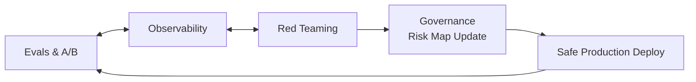

# 8) Continuous Reliability Loop

AI quality is not a one-time certification. Reliability must be sustained through a closed-loop system connecting evals, observability, red teaming, and governance.

## Loop Components

1. **Evals**: benchmark quality/safety before and after releases
2. **Observability**: detect real-user failures and drift patterns
3. **Red Teaming**: proactively probe for novel attack vectors
4. **Governance**: update policy, controls, and escalation pathways
5. **Deployment**: release with guardrails, canaries, rollback plans

## Reliability Playbook

- Define SLOs for quality, safety, latency, and cost
- Route incidents into reproducible test cases
- Maintain release gates tied to eval thresholds
- Perform periodic drift audits by segment and use case
