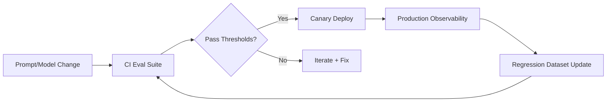

# 9) Tools & Practical Implementation

The goal is an engineering workflow where every model, prompt, retriever, and policy change is measurable before and after deployment.

## Suggested Tooling Stack

- **Evaluation harness**: deterministic test runners + judge models
- **Experimentation platform**: A/B and bandit rollout controls
- **Tracing/telemetry**: session-trace-span observability
- **Policy engine**: safety checks and tool call validation
- **CI/CD integration**: regression gates on pull requests

## Practical Checklist

- Version prompts, retrieval configs, and model IDs
- Keep curated golden datasets per feature
- Include adversarial/security tests in CI
- Track token/cost budgets per workflow
- Add rollback and fallback behavior per release
