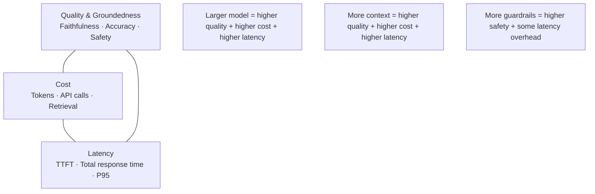

# 10) Key Takeaways

AI QA must be treated as a continuous reliability discipline, not a one-time testing activity. This final section distills the core principles from the entire cookbook, resolves the tensions between competing priorities, and gives you a prioritized implementation roadmap regardless of where you're starting from.

---

## The 10 Core Principles

These principles are the distillation of everything in this cookbook. If you remember nothing else, remember these.

### 1. Deterministic QA Patterns Alone Are Insufficient for Stochastic Systems

A test suite that only checks format, keywords, and exact string matches will miss the most important failures in an LLM system: hallucinations, gradual quality drift, safety regressions, and adversarial vulnerabilities. You need evaluation — multi-dimensional scoring — not just testing.

**Practical implication:** Every LLM feature needs at least one eval metric (faithfulness, relevancy, safety) in CI, not just format assertions.

### 2. Quality, Safety, Latency, and Cost Must Be Evaluated Together

These four dimensions interact in non-obvious ways, and optimizing for any one while ignoring the others creates fragile systems:

- A faster model may hallucinate more
- A safer model (with more refusals) may feel less useful
- A cheaper model may have worse quality on tail cases
- A higher-quality model may cost 10x more at scale

**Practical implication:** Define a composite metric before running any experiment. Never declare a variant "better" based on one dimension alone.

### 3. Defense-in-Depth is Mandatory

No single control — no matter how good — is sufficient against a motivated attacker or the full space of LLM failure modes. Input filters, prompt hardening, output validation, circuit breakers, and governance must all operate in parallel.

**Practical implication:** Map your current defenses to the three-layer model (governance, pre-production, production). Identify which layers are missing and address the gaps by risk tier.

### 4. Production Observability Is as Important as Offline Benchmarking

Pre-production evals run on curated datasets. Production runs on the full, unpredictable distribution of real user queries. Quality issues that don't appear in benchmarks — because they require specific user contexts, combinations of queries, or edge cases — will appear in production. You need both.

**Practical implication:** Instrument session/trace/span telemetry before shipping any AI feature. Set up quality metric monitoring on day one, not as a follow-up project.

### 5. Optimization Loops Should Run Continuously

A/B testing is not a one-time activity performed before launch. The most effective AI products treat optimization as a continuous process: running multiple experiments simultaneously, using bandit algorithms to minimize regret, and analyzing experiment results at the segment level to catch regressions hidden by aggregate improvements.

**Practical implication:** Set up GrowthBook or an equivalent experimentation platform early. Define your composite outcome metric before your first experiment.

### 6. Red Teaming Is Not Optional

Security testing for LLMs is qualitatively different from traditional penetration testing. Attackers probe natural language interfaces in ways that automated scanners don't catch. OWASP LLM Top 10 documents the failure patterns; your job is to test against each of them before every major release and regularly in production.

**Practical implication:** Run Garak on every release candidate. Schedule a manual red-team exercise at least quarterly.

### 7. The Golden Dataset Is Your Most Valuable Asset

A well-curated, version-controlled golden dataset is the foundation of reproducible AI quality measurement. It lets you detect regressions, attribute quality changes to specific modifications, and make confident release decisions. Nothing replaces it.

**Practical implication:** Spend engineering time maintaining your golden dataset. Update it monthly. Add test cases from every production incident.

### 8. Production Incidents Are Test Cases in Disguise

Every time a user reports a bad response, an escalation happens, or a safety filter triggers on a real user input — that's a test case your eval suite didn't have. The teams that improve fastest are the ones that convert incidents to test cases within 48 hours, not the ones that fix the symptoms and move on.

**Practical implication:** Make incident-to-test conversion a defined engineering process with an owner and a 48-hour SLA.

### 9. AI Risk is a Governance Problem, Not Just an Engineering Problem

Engineering can implement controls. Governance ensures those controls are appropriate, accountable, and sustained over time. Without designated risk owners, documented model cards, defined escalation paths, and periodic reviews, even the best technical controls decay as teams change and systems evolve.

**Practical implication:** Assign an AI Risk Owner for every production AI system. Review the risk register quarterly. Document the model card before launch.

### 10. Start Imperfect, Improve Continuously

The biggest failure mode is waiting for a perfect QA infrastructure before shipping anything. A golden dataset of 20 cases and a single faithfulness metric in CI is infinitely better than zero. The Continuous Reliability Loop will improve the infrastructure over time as long as you start the loop running.

**Practical implication:** Get 30 golden dataset cases, one eval metric, and one production trace in place within your first two weeks of building. Everything else builds from there.

---

## The Quality Triangle

The most persistent tension in AI product development is the three-way tradeoff between quality, cost, and latency. Improving any one dimension typically puts pressure on the others:



### Navigating the Triangle

Different applications have different optimal positions on the triangle:

| Application Type | Quality Priority | Cost Priority | Latency Priority |
|---|---|---|---|
| Medical diagnosis support | Critical — no hallucinations | Acceptable overhead | Moderate |
| Real-time customer chat | High | Medium | Critical — <2s |
| Internal knowledge search | Medium | Critical — high volume | Low |
| Legal document analysis | Very high | Low (low volume) | Low |
| Code completion | High | Medium | Critical — IDE-speed |

**The mistake:** optimizing for the wrong position. Teams building real-time chat who use GPT-4o with 10k context + 3 guardrail layers will miss their latency SLOs. Teams building medical tools who use GPT-4o-mini to save costs will miss their accuracy SLOs.

**The fix:** classify your application on the triangle first, then choose model, context strategy, and guardrail depth to fit that classification.

---

## What a Mature AI QA Practice Looks Like

After implementing this cookbook's recommendations, here's what your engineering workflow should look like:

### Development Flow
```
Engineer changes a prompt or model config
  ↓
Pre-commit: format and schema lint (5 seconds)
  ↓
PR opened: eval suite runs automatically (8 minutes)
  ├── Quality gate: faithfulness, relevancy, hallucination ≥ thresholds → pass/fail
  ├── Regression gate: no metric drops > 5% vs. baseline → pass/fail
  └── Security gate: injection resistance ≥ 98% → pass/fail
  ↓
PR blocked if any gate fails → engineer iterates
  ↓
PR approved when all gates pass
  ↓
Release candidate: full suite + security scan (45 minutes) → green for deploy
  ↓
Canary deploy: 1% → 10% → 50% → 100% with monitoring at each step
```

### Operations Flow
```
Production traffic:
  → All requests: latency, error rate, token usage (no quality cost)
  → 5% sample: async quality scoring (faithfulness, relevancy)
  → 100%: output toxicity/PII filter (fast, in-line)
  ↓
Quality dashboard (team reviews daily):
  → Quality trend: 7-day rolling mean by metric
  → Drift alerts: Page-Hinkley detector fires if drift detected
  → Top 10 lowest-quality traces: manual review weekly
  ↓
Incident pipeline (triggered by alerts):
  → P1/P2: page oncall, preserve traces, assess blast radius
  → Within 48h: root cause analysis, regression test case added
  → Within 1 week: hotfix deployed, post-mortem written
```

### Governance Flow
```
Monthly:
  → Automated security sweep (Garak)
  → Golden dataset update from new test cases
  → Baseline refresh

Quarterly:
  → Full red-team exercise (manual + automated)
  → Risk register review and update
  → Model cards reviewed for accuracy
  → Governance review: controls vs. current risk profile
```

---

## Anti-Patterns to Avoid

These are the most common mistakes teams make when building AI QA practices:

**Anti-pattern 1: "We'll add eval after launch."**  
Quality measurement is hardest to retrofit. By the time you "add eval after launch," you have no baseline, no golden dataset, and months of deployment history with no reproducible quality record. Build eval infrastructure in parallel with the feature, not after.

**Anti-pattern 2: "Our LLM judge is biased toward verbose answers."**  
LLM-as-judge is a tool with well-understood biases (verbosity, position, style). The solution is not to avoid LLM judges — they're the only scalable quality measurement approach. The solution is to use calibrated judges (GPT-4o calibrated against human preferences), disagree-and-check patterns (run two judges and flag disagreements), and periodic human spot-checks to validate judge accuracy.

**Anti-pattern 3: "Our safety filter blocks too much."**  
Over-refusal is as much a quality failure as under-refusal. A chatbot that refuses 15% of legitimate requests will lose users. Safety must be tuned with precision metrics (what fraction of refusals were appropriate?) alongside recall metrics (what fraction of harmful content was blocked?). Track both.

**Anti-pattern 4: "Our golden dataset is too small to be meaningful."**  
A golden dataset of 30 cases is better than zero. A golden dataset of 300 cases is not necessarily 10x better — it depends on coverage. Prioritize diversity and coverage over raw size. 50 cases spanning 10 distinct capability areas is more valuable than 200 cases all testing the same scenario.

**Anti-pattern 5: "Regression testing is slowing us down."**  
Regression testing should be fast enough that it doesn't slow development. If your PR eval gate takes 30 minutes, you need to optimize it: run only the affected capability's test cases on PR (full suite on release candidate), use faster judge models for PR gates (save expensive judges for release), cache eval results for unchanged test cases.

**Anti-pattern 6: "We only test the happy path."**  
LLM failures cluster in edge cases, adversarial inputs, and capability boundaries — exactly the inputs that aren't on the happy path. Your golden dataset should be at minimum 30% edge cases and 10% adversarial inputs.

---

## Final Implementation Checklist

This is the complete checklist. Use it to audit your current state and prioritize your next steps:

### Evaluation
- [ ] Golden dataset exists for every production AI capability
- [ ] Golden dataset is version-controlled and updated at least monthly
- [ ] Eval suite runs on every PR with defined quality thresholds
- [ ] Regression baseline exists and is compared on every PR
- [ ] Full eval suite runs on every release candidate
- [ ] Eval results are logged and trended over time

### Security & Safety
- [ ] Injection resistance tests in CI (≥20 variants)
- [ ] Garak or equivalent automated scan on release candidates
- [ ] Toxicity and PII scoring on production output sample
- [ ] System prompt hardened with explicit instruction hierarchy
- [ ] Retrieved content sandboxed in RAG prompts
- [ ] Tool call allowlist with schema validation
- [ ] Red-team exercise conducted in last 90 days

### Observability
- [ ] Session, trace, and span instrumentation deployed
- [ ] Quality metrics tracked on production sample (faithfulness, relevancy)
- [ ] Latency, error rate, and cost metrics in production monitoring
- [ ] Drift detection configured with alert thresholds
- [ ] Dashboard exists for oncall (health) and team (quality) views
- [ ] Production incidents traced back to causal span within 1 hour

### Experimentation
- [ ] Feature flag infrastructure in place for A/B experimentation
- [ ] Composite outcome metric defined before first experiment
- [ ] Safety floor enforced on all experiment variants
- [ ] Stratified analysis configured to detect segment-level regressions
- [ ] Kill switch tested and operational

### Governance
- [ ] AI Risk Owner assigned for each production AI system
- [ ] Risk classification documented for each AI feature
- [ ] Model card exists for each model in production
- [ ] Incident-to-test conversion process defined
- [ ] Quarterly governance review scheduled

### Reliability Loop
- [ ] Eval suite → observability → red team → governance → deploy loop is operational
- [ ] Weekly quality review ritual on team calendar
- [ ] Incident pipeline converts failures to test cases within 48h
- [ ] Baseline refresh and drift audit on weekly schedule

---

## Your First 30 Days

If you're starting from scratch, here is a concrete 30-day path:

**Days 1–5: Instrumentation**  
Set up LangSmith or Phoenix. Instrument your primary LLM workflow with session/trace/span logging. Verify you can trace a response back to its exact prompt and context. Deploy basic error rate and latency monitoring.

**Days 6–10: First Eval**  
Build a 30-case golden dataset for your most critical capability. Run DeepEval with faithfulness and answer relevancy metrics. Establish your quality baseline.

**Days 11–15: CI Gate**  
Add the eval suite to your CI pipeline. Set a quality gate threshold. Run the gate against your current codebase — does it pass? Adjust threshold to be challenging but achievable.

**Days 16–20: Security Baseline**  
Run Garak against your production system. Add 20 injection resistance tests to CI. Harden your system prompt with explicit instruction hierarchy.

**Days 21–25: Production Quality Monitoring**  
Enable async quality scoring on 5% of production traffic. Set up drift alerts. Deploy toxicity and PII monitoring on all output.

**Days 26–30: First Incident Exercise**  
Deliberately introduce a small regression (or find one from your production logs). Practice the full loop: detect in observability, trace to root cause, create regression test case, fix and verify.

After 30 days, you have the foundation. The Continuous Reliability Loop is running. From here, it's a matter of widening coverage, deepening metrics, and accelerating the loop cadence.

---

## Closing Thoughts

The best AI products are not built by teams that got lucky with prompts. They're built by teams that treat quality as a first-class engineering concern: measurable, reproducible, and continuously improving.

The techniques in this cookbook — from the six pillars to the reliability loop — are not academic exercises. They are the practices that separate AI products that earn user trust from AI products that erode it. The difference between a team that systematically tests, monitors, and improves versus one that ships and hopes is visible within 3-6 months in production.

Start the loop. Run it consistently. Everything else follows.
