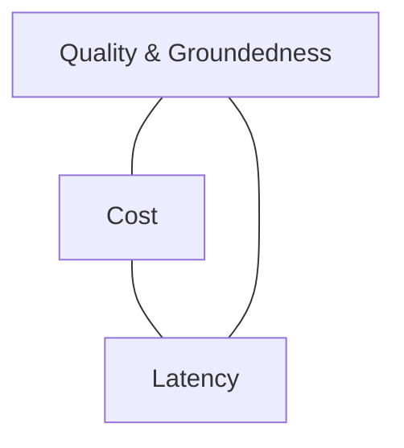

# 10) Key Takeaways

AI QA must be treated as a continuous reliability discipline, not a one-time testing activity.

## Core Principles

1. Deterministic QA patterns alone are insufficient for stochastic systems.
2. Quality, safety, latency, and cost must be evaluated together.
3. Defense-in-depth is mandatory: governance + pre-prod evals + live controls.
4. Production observability is as important as offline benchmarking.
5. Optimization loops (A/B, bandits, regression) should run continuously.

## Quality Triangle

## Final Implementation Checklist

- Build eval suites per feature and risk tier
- Add adversarial + safety testing before release
- Enforce policy checks on tool calls and outputs
- Instrument session/trace/span telemetry in production
- Close the loop: incidents -> tests -> improved releases

This will be build with Docusaurus
